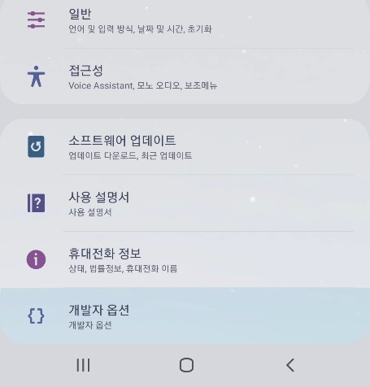
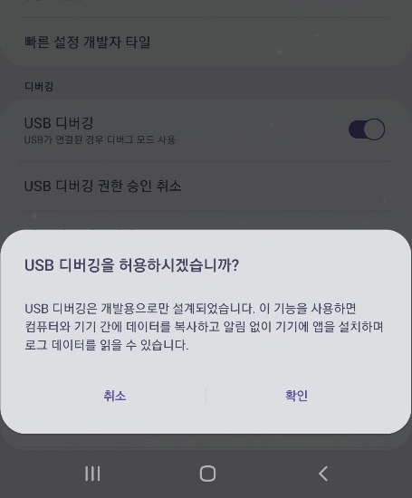
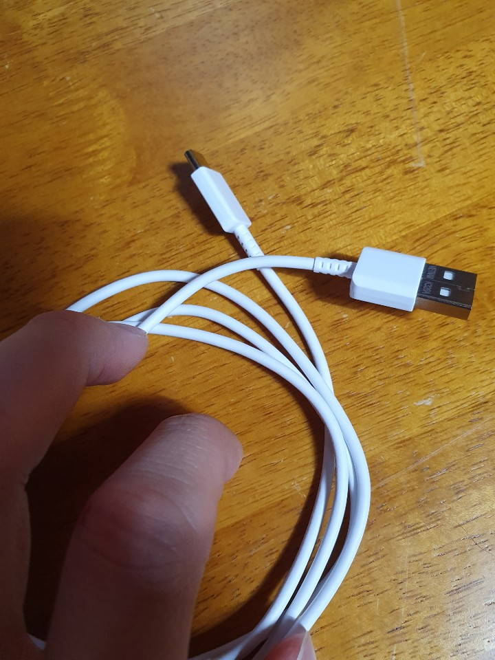
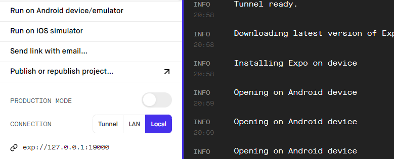

### React-Native 내 Device이용 앱실행(Android)

안녕하세요!!
우리의 휴대폰을 이용하여 App을 실행시켜보도록 하겠습니다.

>(일단 휴대폰에 expo앱이 깔려있다는 전제하에 진행하도록 하겠습니다.)
> 꼭 실제 휴대폰을 사용하지 않더라도 android studio나 xcode와 같은 것을 이용하면 
가상 device로도 test 해볼수 있습니다.

저는 같은 LAN을 잡았는데도 Expo App에서 **timeout** 때문에 실행이 되지않아서 ㅠㅠ  아래와 같은 방법으로 실행했습니다

그리고 제가 Android라 Android기준으로 작성을 해보도록 하겠읍니다... 

## 1 . **설정 - 휴대전화 정보 - 소프트웨어 정보**

## **2 . 빌드 번호 연타 타타타타타타타**

## **3 . 개발자 옵션이 활성화 됩니다 빠밤**

## **4 . USB 디버깅을 허용해줍시다**    

## **5 . 그리고 USB 케이블로 PC와 연결해줍시다**

## 6 . 우리의 프로젝트 앱의 Web page에서 Run on Android device/emulator 를 눌러줍니다

**이때 Connection 옵션을 Local 혹은 Tunnel로 설정해줍니다**

**혹은 터미널 창에서 a키를 입력해서 실행할 수도 있습니다.**

**~~(w를 누르면 그냥 web으로도 실행해 볼수 있습니다.)~~**

### 💡 Connection 옵션에 대해 알아보자

- Tunnel : Expo에서 제공해주는 서버 사용(어디서든 가능)
- LAN : 와이파이 사용
- localhost : 시뮬레이터에서 사용(제일 빠름)

그럼 재밌는 RN 개발이 되길 바라며 총총