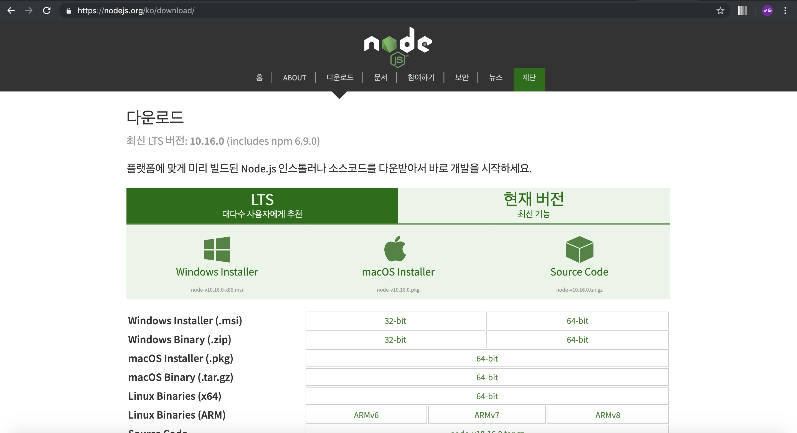
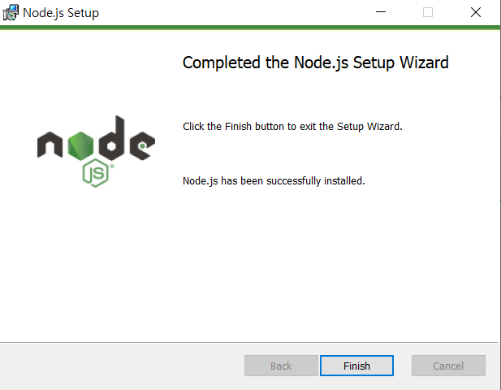
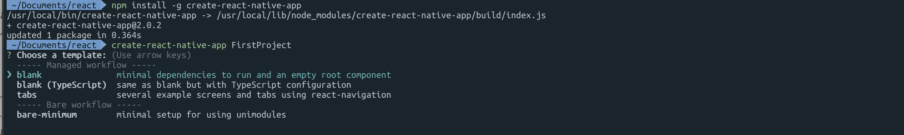
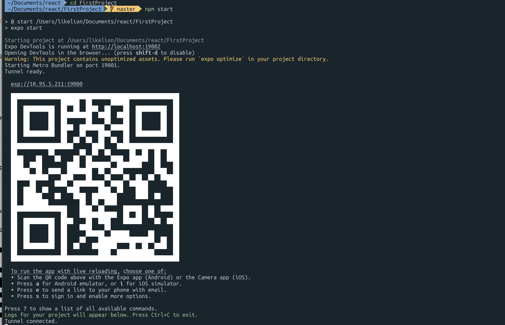
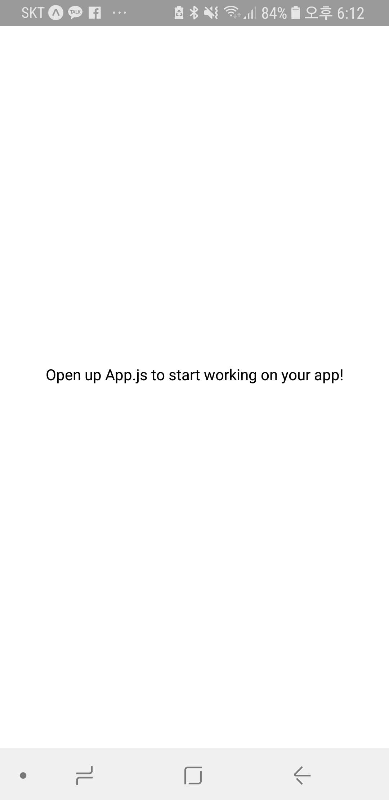

### React-Native expo시작하기

## node.js 설치

npm이라는 패키지 매니저를 설치하기 위해 node.js를 다운로드 받을거에요.
대다수 사용자에게 추천하는 LTS버전을 본인 운영체제에 맞게 다운로드 해주세요.






terminal이나 cmd창을 실행해 node가 제대로 설치되었는지 버전을 확인해봅시다.
버전 출력이 되지 않으시면 컴퓨터를 껐다가 다시 실행해보세요.

## Create React Native App

CRNA는 React Native 프로젝트를 시작하기 훨씬 쉽게 해주는 도구입니다. Expo라는 회사랑 협업해서 만들어진 결과물이에요. 그러니 앞으로 expo라는 단어가 출몰해도 당황하지 마세요! 우리는 앞으로 이 도구를 이용해 프로젝트를 생성할거에요.

```bash
#CRNA 설치
npm install -g create-react-native-app

#해도 되고 안 해도 되는 과정 : 우리가 작업할 directory 생성하기 & 진입(?)하기   
mkdir myfirst_directory
cd myfirst_directory         #tab을 누르면 자동완성기능이 있으므로 적극 활용하도록 합시다

#CRNA로 첫번째 프로젝트 생성하기
create-react-native-app FirstProject
```



template을 선택하라고 하는데, 저희는 blank를 선택할게요. 그리고 앱 이름을 입력하라는 창이 뜰거에요!


`FirstProject`  입력하고 enter 해버립시다.

## 내가 만든 앱 실행하기

```bash
#내 프로젝트 안에 들어가기
cd FirstProject

#내 첫번재 프로젝트 실행하기
npm start
```


프로젝트 생성이 완료되면 우리가 생성한 프로젝트 폴더 안으로 들어가서 `npm start` 를 입력하세요!



그리고 저 큐알코드를 스캔하면 우리의 첫 앱이 실행됩니다.

### **Expo App을 이용하기**

### **같은 와이파이**를 잡고 있어야만 시뮬레이터가 실행됩니다. 이 점 꼭 확인해주세요!

### 안드로이드

playstore에 접속해 `expo` 앱을 다운받아 주세요.
그리고 `Scan QR code` 버튼을 클릭해 QR 코드를 스캔해봅시다.



안드로이드 QR 코드 스캔

### 아이폰

앱 스토어에서 `expo` 앱을 다운 받아주세요. 그리고  카메라 앱을 켜서 QR 코드를 스캔!


아이폰 QR 코드 스캔
