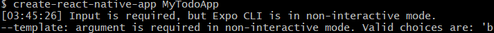
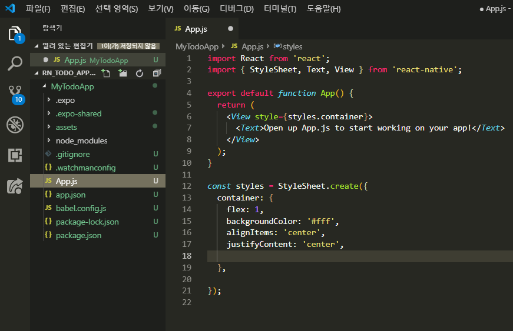
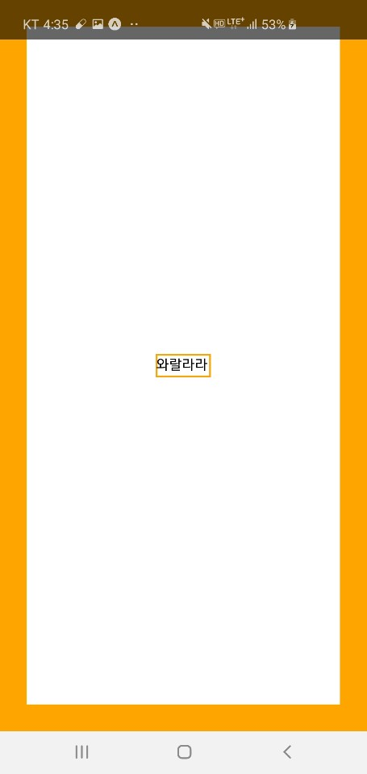
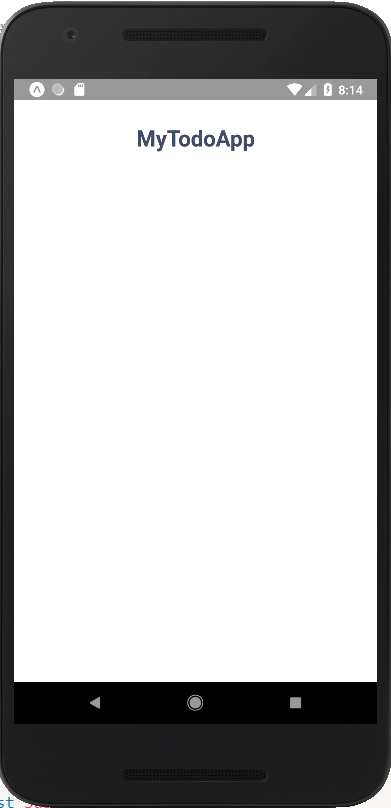
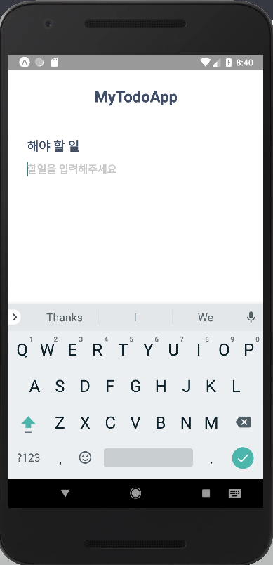
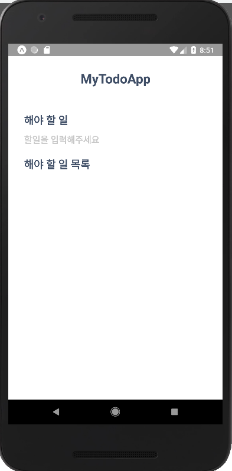

안녕하세요 열어분

드디어 RN 으로 들어왔습니다.
우리는 지금부터 *백문이불여일타* 라는 말처럼 이론보다는 실습을 중심으로 공부해 나갈꺼에요

첫번째로 개발의 시작이라 할 수 있는 To-Do앱을 만들어 볼껍니다 
우리는 저번 시간에 React의 기본개념에 대해서 공부를 했으니 
실습을 하며 필요한 부분만 살펴보면서 넘어가도록 해요!!

# 프로젝트 생성

cmd창이나 shell창에서 App을만들어 줍시다. App 만드는 방법이....

- MyTodoApp 만드는법

1. create-react-native-app MyTodoApp(이름은 자유롭게 지으셔도 됩니당)
2. 기본 blank선택
3. App name 작성후 Enter


- 앗 저는 *but Expo CLI is in non-interactive mode*하면서 만들어 지지않아요 ㅠㅠ

git bash에서는 

저런 Error가 뜨니 일반적인 cmd 혹은 window의 경우 powershell을 사용해주세요

참! 그리고 저는 code editor를 VScode를 사용할 예정입니다.

- 저와 같이 MyTodoApp VSCode로 편집하기

VScode 폴더열기로 MyTodoApp을 열어도 되구
MyTodoApp 폴더 내부에서 git bash 를 열어 code . 을 입력하여 VScode를 열어도 되구
다른 cmd에서 MyTodoApp의 경로까지 찾아와 code . 으로 열어도 무방합니다!!

# 프로젝트 실행

그럼 App을 만들었으니 실행을 시켜봅시다

```powershell
cd MyTodoApp
```

```powershell
npm start
```


그리고 QRcode or가상 Device or 본인의 기기에서 App을 실행시켜줍시다.
오른쪽과 같은 화면이 보일꺼에요
즉 `npm start` 명령어를 실행하게 되면 
App은 가장 먼저 `App.js`(메인...★)을 보여줍니다.

- App.js 를 못찾으시겠다구요??




# App.js 뜯어보기

```jsx
import React from 'react';    //React를 사용할 수 있게 import(가져오기)

import {StyleSheet, Text, View} from 'react-native'; //RN이 제공해주는 기본component import

export default function App() {   //App이라는 component를 만들어주면서 export로 모듈화합니다
  return (                        
    <View style={styles.container}>   {//아래에서 선언한 스타일을 적용시켜줍니다.}(JSX방식)
      <Text>메인화면에 뜨는 글자!</Text> {//App.js가 메인화면이라서 Text따라 메인화면도 바뀜다}
    </View>
  );
}

const styles = StyleSheet.create({ //styles 라는 객체를 만들고             
  container: {                     //꾸미고 싶은 속성들을 객체화 해서 객체안에 저장합니다.
    flex: 1,
    backgroundColor: '#fff',
    alignItems: 'center',
    justifyContent: 'center',
  },            //객체가 끝난 뒤에 , 를 적어주면 나중에 객체사이에 ,로인한 Error가 줄더라구요
});
```

즉 위의 App이라는 function 

그러니까 Component는 `<View style={styles.container}>` 부분을 return해 화면에 띄워줍니다.
이때 `<View>` 와 `<Text>`는 RN이 제공해주는 기본 Component로 

Component들이 모여 더 큰 Component를 만드는 것을 볼수 있습니다.
위의 코드를 그대로 붙여 넣어봤는데 안돼요!
위의 `JSX`표현식이 있는 단락에서는 //라는 JS의 주석처리가 아닌
{/* 주석처리 */} 와 같은 `JSX`만의 방식을 사용해야합니다.

하지만 VScode에서는 간편히 ctrl + /로 주석처리를 할 수 있지요

---

기본 Component에 대해서 조금 알아봅시다( 필요한게 있으면 찾아서 쓰면 되겠죠~?)
- `<View>`는 HTML의 `<div>` 의 역할을 하며,
다른 Component를 담을 수 있습니다
우측 그림에서 맨 바깥쪽 주황네모입니다


- `<Text>`는 문자를 표현하는 Component로
RN에서는 Text만이 순수하게 문자를 표현합니다
우측그림에서 중앙의 Text를 둘러싼 
주황네모입니다.



- LayOut확인하는 팁

```jsx
<View style={styles.container}>
      <Text style={styles.mytext}>와랄라라</Text>
</View>

const styles = StyleSheet.create({
  container: {
    ...
    borderWidth: 30,
    borderColor:'orange',
  },
  mytext:{
    ...
    borderWidth: 2,     
    borderColor: 'orange',
  }
});
```

위와 같이 style에  border속성을 주면 
해당 Component가 어느정도의 box크기를 가지는지 눈으로 확인 할 수 있습니다.
참 말이 나와서 말인데 속성간에  , 로 구분하는 쉼표 잊지마세요!!!

---

# Component만들기

우리가 만들 UI는 이런 모양입니다. 
오른쪽의 UI를 보고 어떤 component가 
필요하겠다

구조를 그리고 시작하시면 코드짜는데 
많은 도움이 될 거에요!


우리가 사용할 components를 만들기위해 
프로젝트 폴더 - app  - components 를 생성합니다
그리고 components안에서 부품들을 생성할꺼에요

# Header(제목) 부품 만들기

```jsx
// MyTodoApp/app/components/Header.js

import React from 'react';
import { View, Text } from 'react-native';

const Header = () => (   //Arrow function사용,() => (return값) 의 형태로 사용해주었습니다
  <View>
    <Text>제목입니다</Text>
  </View>
);

//위의 식을 이렇게 명시적으로 return을 적어줄수도 있습니다.
//  const Header = () => {
//  return (
//  	<View>
//      <Text>제목입니다</Text>
//    </View>
//  )};

export default Header;
```

# Header를 App에 붙이기

```jsx
// MyTodoApp/App.js

import React from 'react';
import { StyleSheet, Text, View } from 'react-native';
import Header from './app/components/Header'; 
//default로 내보낸것을 Header라는 이름으로 가져옵니다.

export default function App() { 
    return (
      <View style={styles.container}>
         <Header></Header>     {/*기존에 있던 <Text>대신 작성합니다*/}
      </View>
    );
}

...중략...

```

App을 실행해보시면 처음 실행화면이랑 크게 달라지지 않았어요   
왜냐면 style을 따로 지정해주지 않았구 그저 `<Text>` 자리에 `<Header>`가 들어가기만 했거든요   
그럼 App.js에서 봤던 것 마냥 style객체를 만들어 `Header`의 style을 지정해보도록 하겠습니다.

# style 꾸며주기

일단 App.js에 들어있던 style의 모양을 기억해봐요

1. `import {StyleSheet} from 'react-native';`
기본 compo(StyleSheet)를 사용하기위해 import
2. `const styles = StyleSheet.create({....});`
style속성을 객체로 만들어 styles 안에 보관
3. `<View style={styles.container}>` 
원하는 component에
styles객체에서 객체를 참조해 스타일 지정

```jsx
import {StyleSheet} from 'react-native';

<View style={styles.container}> 

const styles = StyleSheet.create({
  container: {            
    flex: 1,
    backgroundColor: '#fff',
    alignItems: 'center',
    justifyContent: 'center',
  },
});
```

그럼 이제 우리가 만들었던 Header.js에도 응용해봅시다(가이드라인입니다 이건)

```jsx
import React from 'react';
import { View, Text, StyleSheet} from 'react-native';

const Header = () => (   
	  <View style={style.headerContainer}>
	    <Text style={styles.headerText}>제목입니다</Text>
	  </View>
);

const styles = StyleSheet.create({
		headerContainer:{
			marginTop:70,
			marginBotton:40,
	},
		headerText: {
			fontSize: 26,
			fontWeight: 'bold',
			color:'#3f4e66',
	},
})

export default Header;
```

App.js 에서 봤던 구조랑 똑같죠?? 

style의 속성을 하나씩 추가,그리고 저장을 통해 reloading 되는 App에서
각 속성이 어떻게 동작하는지 알아보는 것도 좋습니다.
위의 가이드라인을 참조하여 본인만의 UI를 구성해보세요

# Header 위치조정

그런데 아직 `Header`의 스타일만 변경되었지 위치는 그대로 입니당

Header.js에서는 위치관련 스타일을 지정해 준 적이 없었죠?. 
App.js안에서 어떻게 위치하는가의 문제이니 App.js로 한번 넘어가보도록 하죠!

styles 객체 안 container 객체 안에
`flex`, `alignitems`, `justifyContent`가 있네요!

- `flex` : 1,
해당 compo의 크기를 100%로 맞춤

- `alignitems` : '`center`'
자식(하위) compo를 가로로 가운데정렬

- `justifyContent` : '`center`'
자식(하위) compo를 세로로 가운데정렬

- *flex 공부하는 flex*
[Flexbox Froggy](https://flexboxfroggy.com/#ko)
[NAVER D2](https://d2.naver.com/helloworld/8540176)

```jsx
// App.js
<View style={styles.container}>
	<Header></Header>
</View>

const styles = StyleSheet.create({
  container: {
    flex: 1,
    backgroundColor: '#fff',
    alignItems: 'center',
    justifyContent: 'center',
  },
}); 
```

따라서 `App`에서 해당 속성들을 조절해보도록 합시다

```jsx
// App.js
<View style={styles.container}>
	<View style={styles.headercentered}> {/* header위치만 조정하고 싶어서 View 추가했어요 */}
		<Header/>                {/* <Header></Header>안에 내용이 없으므로 바로 닫아줬슴다 */}
	</View>
</View>

const styles = StyleSheet.create({
  container: {
    flex: 1,
  },
	headercentered : {
		alignItems : 'center';
	},
}); 
```



# Subtitle만들기

그럼 `Header`를 만든것 처럼  `SubTitle`도 만들어 보겠습니다.
(비슷한내용이라 설명은 자세히 안 드릴께요)

```jsx
// app/components/SubTitle.js

import React from "react";
import {View,Text,StyleSheet} from "react-native"

const SubTitle = () => (
    <View>
        <Text style={styles.subTitleText}>해야 할 일</Text>
    </View>
);

styles = StyleSheet.create({
    subTitleText: {
        color: "#3f4e66",
        fontSize: 18,
        fontWeight: "bold"
    }
})

export default SubTitle;
```

```jsx
// App.js 
...중략...
import Header from './app/components/Header'
import SubTitle from './app/components/SubTitle'

...

<View style={styles.container}>

    <View style={styles.headercentered}>
        <Header/>
    </View>

    <View style={styles.subContainer}>
      <SubTitle/>
    </View>
  </View>

...

const styles = StyleSheet.create({
  container: {
    flex: 1,
  },
	headercentered : {
		alignItem : 'center';
	},
  subContainer: {
    marginLeft:20,          //Q) SubTitle Component에서 설정해주면되지 왜 여기서 해주나요?
  },                        //A) App.js 메인화면의 Layout을 잡아주기 위해 여기서 했습니당
}); 
```

# Input 만들기

```jsx
// app/components/InputBox.js

import React from "react";
import {TextInput,StyleSheet} from 'react-native';

const Input = () => (
    <TextInput 
				style={styles.input}                
        placeholder={"오늘의 할 일"}
        maxLength={30}
        returnKeyType="done"/>      {/* 가독성을 위해 줄바꿈을 해준겁니다 */}
);   

const styles = StyleSheet.create({
    input: {
        fontSize: 25,
        paddingTop:15,
    }
})

export default Input;
```

- `placeholder` : input창에 보이는 연한 글씨
- `maxLength` : 입력 최대길이
- `returnKeyType` : 완료버튼에 출력될 글자

```jsx
// App.js

...중략...
import SubTitle from './app/components/SubTitle'
import Input from './app/components/Input'

...중략...

		<View style={styles.centered}>
	     <Header/>
    </View>
    <View style={styles.subContainer}>
		      <SubTitle/>
					<Input/>
    </View>

...중략

```



# 코드 재사용하기
그런데 우리가 App을 만들다 보면 매번 Component를 새로 만들 순 없습니다.
중복되는 component는 재사용하고 싶은데요!! 그럴때 component의 Props 를 사용해주면 됩니다
Props는 상위 compo → 하위 compo로 전달됩니다

우리의 App에선 App이라는 component에서 
<Header/>, <Subtitle/>과 같은 compo로 정보가 전달이 되는것이죠!
(이 `Props`는 변경될 수 없습니다)

```jsx
// App.js
...중략...
import SubTitle from './app/components/SubTitle'
import Input from './app/components/Input'

...중략..

		<View style={styles.centered}>
	     <Header/>
    </View>
    <View style={styles.subContainer}>
          <SubTitle title="할 일을 입력해주세요"/>  {/*SubTitle compo에 title props 전달*/}
          <Input/>
    </View>
		<View style={styles.subContainer}>
          <SubTitle title="해야할 일 목록"/>
    </View>

...중략

```


```jsx
// SubTitle.js
...중략...
const SubTitle = ({title}) => (  //함수의 argument에 Props로 넘어온 title값을 넣어 사용함다
    <View>
        <Text style={styles.subTitleText}>{title}</Text>
    </View>
);
...중략...
```



# To-Do List Item 만들기

최종 목표부터 다시 보고 가겠습니다
앞으로 만들어야 할게 무엇 무엇이 더 있나요

Todo-Item도 만들어야하구 
Icon같이 보이는 애도 추가해줘야합니다


그럼 Component를 만들고 붙이는 연습은 충분히 했으니 오늘도 열심히 만들고 붙여봅시다

```jsx
// app/components/TodoItem.js

import React from "react"
	import {View,Text,StyleSheet,Dimensions} from "react-native"

const TodoItem= () => (
    <View style={styles.todoContainer}>
        <View>
            <Text style={styles.todoitem}>할일 1</Text>
        </View>
    </View>
);

//아래 코드없이 실행해보구 추가하고 실행해보세요! 차이가 보이실껍니다
const {width,height} = Dimensions.get('window'); //Dimensions는 현재 App이띄워지는 
																					   	//화면의 width와 height를 받아와 저장해줌다  

const styles = StyleSheet.create({
    todoContainer: {
        padding: 5,
        marginTop: 20,
        borderBottomWidth:1,      
				width: width-40,          //얘는 전체 길이보다 40만큼 작게 해서 여유를 주는것입니다
				//width를 위에서 선언과 초기화 해주지 않으면 사용할수 없어요 width-40해줄수 없어요
    },
    todoitem: {
        fontSize: 20,
    },
})

export default TodoItem;
```

```jsx
//App.js

<View style={styles.container}>
  <View style={styles.centered}>
      <Header/>
  </View>
  <View style={styles.inputContainer}>
    <SubTitle title="To-Do 입력"/>
    <Input/>
  </View>
  <View style={styles.todoContainer}>
    <SubTitle title="To-Do List"/>
    <TodoItem/>
    <TodoItem/>
  </View>
</View>

<TouchableOpacity>
<AntDesign name="checkcircle" size={20}/>
</TouchableOpacity>
```
# Icon으로 버튼 추가하기

To-do list에서 한 일을 체크하려면 checkbox같은 애가 필요합니당
그래서 우리는 친절한 expo가 제공하는 Icon을 가져와 버튼으로 checkbox처럼 만들어 줄꺼에요
아래의 링크에서 가져와주세요

[@expo/vector-icons directory](https://expo.github.io/vector-icons/)

그럼 이렇게 아이콘 이름 ,컴포넌트 이름 으로 구성이 되어있습니다. 


그리고 우리가 가져온 것은 단순 icon뿐이므로 
해당 icon이 버튼처럼 터치가 가능하도록 기능을 추가하겠습니다

TouchableOpacity라는 component를 가져와서 사용해줄꺼에요! 이름부터 터치관련인게 보이죠?

```jsx
// TodoItem.js

...중략...

import {View,Text,StyleSheet,Dimensions,TouchableOpacity} from "react-native"
import {AntDesign} from "@expo/vector-icons"  //expo가 제공해주는 component를 import합시다

const {width,height} = Dimensions.get('window');

const TodoItem= () => (
  <View style={styles.todoContainer}>
    <View>

			<TouchableOpacity>   {/* touchable compo를 주석처리하고 해보세요*/}
      <AntDesign name="checkcircle" size={20}/> //component에서 사용할 icon을 props로 제공
			</TouchableOpacity>  

      <Text style={styles.todos}>할일 1</Text>
		</View>
  </View>

...중략...

```

그런데 실행을 해보면
우리의 button layout이 일반적이지 않습니다. 
아이콘이 할 일 위에 올라가 있는게 맘에 안 들어야해요!!!!

그리고 했던 일에 대해서는 삭제할수 있는 버튼도 만들어 놓으면 좋겠죠? 한번에 해버립시다.

```jsx
// TodoItem.js

...중략...

 <View style={styles.todoContainer}>
    <View>
      <View style={styles.lineContainer}>

					<TouchableOpacity>  
				      <AntDesign name="checkcircle" size={20}/>
				 <TouchableOpacity>  

		      <Text style={styles.todos}>할일 1</Text>
					<TouchableOpacity>  
	            <AntDesign name="closecircle" size={20}/>
	        </TouchableOpacity>
				</View>
		</View>
  </View>

const styles = StyleSheet.create({
    
			...
    lineContainer: {
        flexDirection:'row',      //RN은 기본적으로 column으로 설정되어있어요
    }
})
```
실행을 시켜보면 `component`들이 너무 따닥따닥 붙어있나요?? 그럼 조정해줍시다
```jsx
// TodoItem.js

			.....
				<View style={styles.makerow}>
            <TouchableOpacity>  
                <AntDesign name="checkcircle" size={20} style={styles.checkbtn}/>
            </TouchableOpacity>
            <Text style={styles.todos}>할일 1</Text>
        </View>
			....
    lineContainer: {
        flexDirection:'row',
        justifyContent:'space-between'   //가로 정렬하는데 compo사이를 균등하게 space로 구분
				alignItems:'center'     //세로정렬
    },
		checkbtn: {
				marginRight:20,      //checkbtn에서 할 일을 오른쪽으로 떨어트리기 위해 사용
		},
		makerow:{
				flexDirection:'row',
		},
```

실행을 시켜보시면 UI가 Icon덕분에 꽤나 이뻐졌어요
우리는 방금 TodoItem Component를 만든겁니다!!

하지만 매번 목록아이템1, 목록아이템2 
이렇게 만들어 줄수는 없잖아요


그러니까 `Props`를 이용해서 `Component` 재사용을 해줍시다

```jsx
// App.js

    <View style={styles.todoContainer}>
      <SubTitle title="To-Do List"/>
      <TodoItem text="코딩하기" />
      <TodoItem text="운동하기"/> {/*우리가 사용할 이름의 Props를 넘겨줍시다*/}
    </View>
  </View>
```

```jsx
// TodoItem.js
    
  const TodoItem= ({text}) => (
      <View style={styles.todoContainer}>
          <View>
              <View style={styles.lineContainer}>
	                <View>
	                  <TouchableOpacity>  
	                      <AntDesign name="checkcircle" size={20} style={styles.checkbtn}/>
	                  </TouchableOpacity>
	                  <Text style={styles.todos}>{text}</Text>
	                </View>
	                <TouchableOpacity>  
	                    <AntDesign name="closecircle" size={20}/>
	                </TouchableOpacity>
              </View>
          </View>
      </View>
  );
```

비로소 처음에 봤던 모양의 MyTodoApp UI가 구성되었습니다!! 짝짝짝
박수박수 따라오신다구 수고하셨어요! 다음시간부터는 기능을 넣어서 실제로 동작하도록 해봅시다