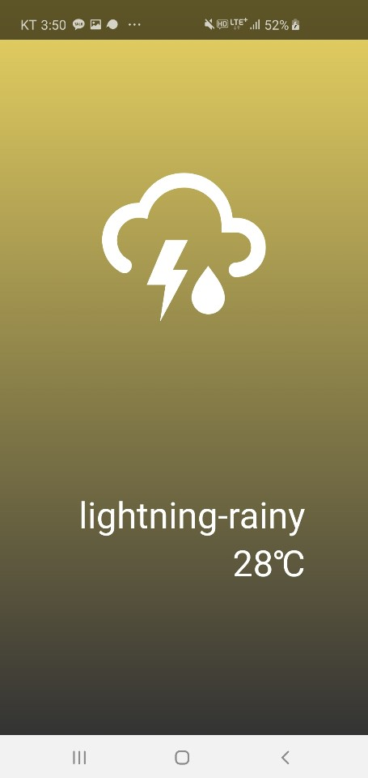
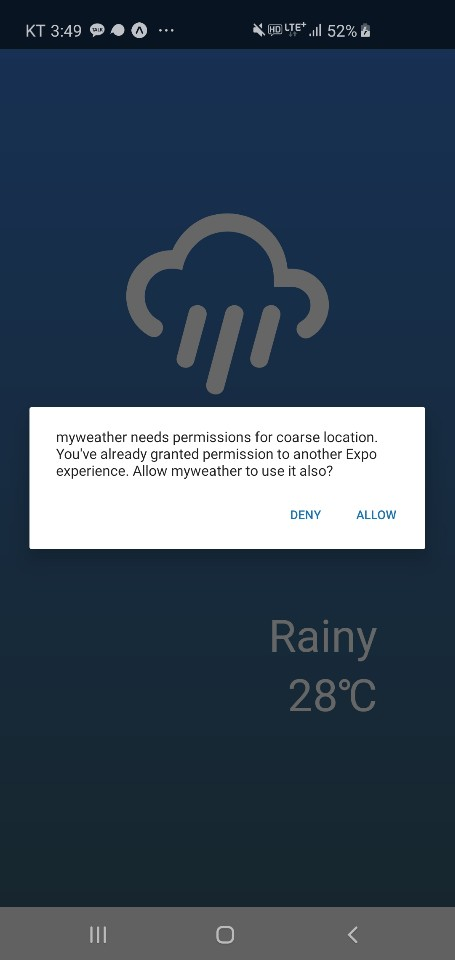

안녕하세요!
1개의 App을 만들고 아주 기쁜마음으로 다음 App을 시작해보도록 합시다
제목에도 나와있듯 우리는 이번시간을 통해
API를 적용하는 방법을 중점적으로 배우게 될거에요

우리가 만들 App의 대략적인 모양입니다
그럼 이번시간에 나아갈 순서에 대해서 이야기를 해보도록 합시다

1. 배경효과 주기 + 전체적인 구조 잡기
2. loading기능 넣어주기
3. weather API를 이용해서 날씨정보 가져오기
4. Location 기능을 이용해 내 위치 정보 사용하기



*

# 0. 사전 준비

```shell
create-react-native-app <App Name> 으로 우리의 App을 만들어 줍시다
```

```jsx
export default class App extends React.Component { 
render() {
    return ();
			  }
}
```

이런 모양으로 App component도 function → Class로 바꿔줍시다   
(기억 안나시면 TodoApp만들기를 참고해주세요!)

왜냐면 우리는 이번시간에 변하는 날씨 DATA를 가져와서 띄워 줄 것이므로 
변하는 값 = State를 사용해야합니다

```jsx
//App.js
import React from 'react';
import { StyleSheet, Text, View } from 'react-native';

export default class App extends React.Component {
  render(){
    return (
      <View style={styles.container}>
				<TEXT>HI!</TEXT>
      </View>
    );
  }
  
}  

const styles = StyleSheet.create({
  container: {
    flex: 1,     //불필요하다고 생각하는 StyleSheet 요소들을 지워줬습니다.
  },
});
```

*

# 0-1 . Component만들어 놓기

저는 App Component는 날씨 정보를 받아오고 
다른 Component를 render해주는 Component로 사용하려 합니다 
따라서 날씨와 관련된 정보를 보여주는 새로운 Component를 만들어야 하는데요 
Weather이라는 이름으로 만들겠습니다

```jsx
//App.js
...
import Weather from './app/Weather'   //요렇게

export default class App extends React.Component {
  render(){
    return (
      <View style={styles.container}>
				<Weather/>
      </View>
    );
  }
```

```jsx
//Weather.js

import React from 'react';
import { StyleSheet, Text, View } from 'react-native'; 

export default function Weather(){ // Props를 가져와서 사용할 예정이므로 fucntion
    return(
			<View style={styles.weatherback}>
	    <View style={styles.weatherroom}>         
				<Text style={styles.textcustom}>번개모양 </Text> {//  번개 Icon을 대신해서 임시방편}
	    </View>
	
	    <View style={styles.textroom}>
	        <Text style={styles.textcustom}>번개가 번쩍번쩍</Text> {//날씨를 나타내는 부분}
	        <Text style={styles.textcustom}>번개는 뜨거워</Text>   {//기온을 알려주는 부분}
	    </View>
			</View>
    )
}

const styles = StyleSheet.create({
		weatherback:{
			flex:1
		},
    weatherroom:{
        flex:2,
        justifyContent:"center",  //세로 가운데 정렬
        alignItems:"center",      //가로 가운데 정렬
    },
    textroom:{
        flex: 1,
        alignItems: "flex-end",   //가로위치를 flex가 끝나는 시점에 위치시킴 ≒ 오른쪽정렬
        paddingRight:70,          //padding은 box은 내부들어오는 방향인데 Right이므로
																	//박스의 오른쪽부분을 안으로 70만큼 들여라라는 의미 입니다
    },
    textcustom:{
        fontSize:50,              //말그래도 fontSize를 나타내는 부분입니당
        color: 'white',           //글자 색을 흰색으로 바꿔주는 부분
    },
});
```

제가 `Weather component`를 미리 조금 꾸며 봤습니다

- `<View>,<Text>` 에 대한 설명

`<View>` 는 간단하게 web에서 사용했던 `<div> tag` 라고 생각해주시면 되겠습니다
`<Text>` 는 글자를 나타내기 위한 component이지만 `span` 이라고 생각해주세요!

따라서 우리는 어떤 특정한 text나 icon의 color나 size를 조절하고 싶으면
해당 component의 style에 직접적으로 styleSheet를 먹여야합니다

반면 그를 둘러싼 box 를 조정하고싶으면 해당 item의 주변을 
<View>로 감싸서 StyleSheet를 먹이도록 합시다

- 그다음 flex에 대해서 알아보도록 하죠!

일단 main App compo에서 flex를 1로 주고 있기때문에 화면 전체를 덮었습니다
그래서 그의 바로 자식이 되려는 weather의 weatherback부분도 flex 1로 주어서 화면 전체를 덮구

다음으로 날씨 icon이 있는 상단부와 Text부분이 있는 하단부의 비율을 조정하려합니다
날씨 icon이 있는 부분이 전체화면의 2/3  Text가 있는 부분이 화면의 1/3 을 차지합니다
비율로 보면 2:1이잖아요???
그래서 상위 weatherback View의 하위 
weatherroom 과 textroom의 flex를 각각 2,1 로 주어 전체화면에서 차지하는 비중을 조절합니다.

만약 극단적으로 9,1  이렇게 주면 icon이 차지하는 부분이 90% Text가 차지하는 부분이 10%가 되겠죠?

***

# Linear Gradient

이제 본격적으로 꾸며보도록 합시다
보면 우리의 날씨 App의 배경에 그라데이션 효과가 들어가있죠??
우리는 이를 expo에서 제공해주는 Linear-Gradient를 이용해서 해보겠습니다!!

🔻아래에 공식 expo홈에서 `LinearGradient`설명과 사용방법이 나와있으니 참고하시면 되겠습니다

[LinearGradient](https://docs.expo.io/versions/v34.0.0/sdk/linear-gradient/)

```jsx
//Weather.js
import React from 'react';
import { StyleSheet, Text, View } from 'react-native';
import { LinearGradient } from 'expo-linear-gradient';   // LinearGradient를 import

return (
                
    <LinearGradient
        colors={['#e9d362', '#333333']}   //colors = {[ top-color , bottom-color ]}
        style={styles.weatherback}>       //위에서 View에 먹인 weatherback을 가져옴
      <View style={styles.weatherroom}>         
        <Text style={styles.textcustom}>번개모양 </Text>
      </View>
  
      <View style={styles.textroom}>
          <Text style={styles.textcustom}>번개가 번쩍번쩍</Text> 
          <Text style={styles.textcustom}>번개는 뜨거워</Text>   
      </View>
      </LinearGradient>
```

이렇게 LinearGradient를 사용해주도록 하겠습니다.

변경사항들에 대해서 보면 weatherrom 과 textroom을 감싸고 있던 <View> 대신 
<LinearGradient>를 넣어주고 weatherback style을 지정해주면서 flex 1 설정을 해주었습니다.

참! colors 가 list의 형태로 색깔을 받아서 표시를 해주고 있잖아요
🔻아래사이트는 gradient를 모아놓은 거라서 여러분의 취향에 맞게 가져오시면 됩니당
[uiGradients - Beautiful colored gradients](https://uigradients.com/#Shifty)

# ICON 넣기

TodoApp을 만들때 ICON을 넣었던거 기억나시나요!!!!!!!
🔻지금은 간단하게 번개예제로 구조를 잡고 있으니 어울리는 ICON을 가져와봅시다
[@expo/vector-icons directory](https://expo.github.io/vector-icons/)

```jsx
//Weather.js

		<LinearGradient
        colors={['#e9d362', '#333333']}
        style={styles.weatherback}>
        <View style={styles.weatherroom}>
         <MaterialCommunityIcons name={'weather-lightning'} size={200} style={styles.icon} />
        </View>

 //...

 const styles = StyleSheet.create({
    ...
    icon:{
        color: 'white',        //큰 것은 아니지만 우리가 가져온 Icon의 색깔을 변경해줍니다.
    }
});
```

TODOAPP에서 한번 ICON을 사용해보았으니 그렇게 어렵지 않죠?
이제 어느정도 전체적인 구조는 잡았습니다!


# loading기능 넣어주기

이제 전체적인 구조도 잡았겠다, 날씨를 가져와서 보여주는 작업만 하면 됩니다
그런데!  잘 생각해보면 웹이나 앱에서 정보를 받아올때 바로 정보가 딱! 뜨던가요?
가장 가까운 페이스북만 보더라도 타임라인이 팍! 뜨는게아니라 로딩.... 짠! 하면서 뜨잖아요!?
그래서 우리도 지금부터 그와같이 구현해보겠습니다
왜냐면 날씨정보를 받아오지않은상태에서 우리의 Weather Component를 조작하려고하면 나중에
Error가 발생할 수 있거든요. 

JS는 undefined된 값도 가질수 있기때문에 
날씨를 가져오기전 undefined를 넘겨주면 문제가 생기는거에요

```jsx
//App.js
import { StyleSheet, Text, View, ActivityIndicator} from 'react-native';

...

export default class App extends React.Component {
  constructor(props){
    super(props);
    this.state={
      isLoaded : false,
    }
  }

...

render(){
    return (
      <View style={styles.container}>
       {this.state.isLoaded? <Weather /> : 
       <ActivityIndicator style = {styles.indicator} color='black' size = "large"/>} 
      </View>
    );
  }
}

const styles = StyleSheet.create({

   ...

  indicator:{
    flex:1,
    alignItems:"center",
    justifyContent: "center",
  },
});

```

위에보시면 새로운 Component를 가져온것을 알수있는데요
`ActivityIndicator` 는 Loading할떄 빙글빙글 돌아가는 그런 효과를 넣어주는 Component입니다
isLoaded는 정보호출이 끝나면 로딩이 완료되었다고 변할값이므로 State로 선언해주었구

삼항연산자를 통해 
isLoaded가 true이면 == 로딩이 완료되었으면 == 정보를 Weather Component에 넘겨주면서 Weather Component를 불러와라
isLoaded가 false이면 == 정보가 아직 준비안됐으면 == 로딩중이라는 효과를 화면에 보여줘입니다

따라서 지금 우리는 isLoaded의 값을 수동으로 true, false로 바꿔가며 해당 
삼항연산자로 선택적 rendering이 잘 되는지 확인해주면 되겠습니다
나중에 날씨정보를 받아오는 부분에서 우리가 isLoaded의 값을 setState로 바꿔주도록 할께요!

# weather API를 이용해서 날씨정보 가져오기

이제 본격적으로 weather API를 받아오도록 할껀데요, 우리는 openweather이라는 서비스를 이용할거에요

🔻 아래 보이는 website에 가서 가입을 해주도록  합시다
[Сurrent weather and forecast - OpenWeatherMap](https://openweathermap.org/)

그리구 여기 들어가보시면 각자 부여된 API Key를 확인 할 수 있는데요
[Members](https://home.openweathermap.org/api_keys)

우리는 우리에게 부여된 Key를 이용해 API를 사용할 권한을 얻게 된것입니다

🔻 이 그림에서 친절하게 API Key는 어떻게 사용해라 알려주고 있죠?


우리가 사용하고자 하는 API의 URL 뒤에 `APPID = 우리의 API_Key`를 붙여주면 됩니다
그럼 상단의 API tab → Current weather data 를 찾아서 들어가봅시다

사실 꼭 이렇게 들어가야 하는건 아닌데 우리가 지금 사용하고 싶은게
현재 날씨 data를 사용하고 싶기때문에 이렇게 들어가고 있습니다.

🔻아래 그림과 같이 위도와 경도를 사용한 API의 사용방법과 함께 API를 사용했을때 response값이 있습니다


🔻그리고 거의 마지막까지 내리면 아래 그림과 같이 Celsius(섭씨) 를 사용하기 위해서는 units=metric을 사용하라는 말까지 있습니다


그럼 이제 우리는 위의 예시 3개를 조합해봅시다 API 가져오기  + 내 API_KEY를 사용하기 + 섭씨로 바꾸기

[api.openweathermap.org/data/2.5/weather?lat=35&lon=139](http://api.openweathermap.org/data/2.5/weather?lat=35&lon=139)&APPID=MYAPIKEY&units=metric

이런 모양이 되었습니다! 짜잔 이렇게 여러분들이 사용하고 싶은 설정이라던지 API가 있으면 example이 나와있으니 참고하셔서 사용을 해주시면 됩니다!

```jsx
//App.js
import { StyleSheet, Text, View, ActivityIndicator} from 'react-native';
import Weather from './app/Weather';

const API_KEY = "b7f1c4c0d46c7235a9ed00e747ee1f9e"  //우리의 API key를 상수로 설정해 가져와 사용합니다

componentDidMount(){
    this._getWeather()                  //#4의 라이프사이클에서 언급했었던 
  }                                     //component가 HTML에 맞게 rendering되고 _getWeather을 실행하란 말입니다
_getWeather = async() =>{
   const _response = await fetch(`http://api.openweathermap.org/data/2.5/weather?lat=35&lon=139&APPID=${API_KEY}&units=metric`)
   const _json = await _response.json()

   this.setState({isLoaded: true, temp: Math.floor(_json.main.temp), title : _json.weather[0].main})
}
```

`componentDidMount()`  는 react의 life cycle과 관련된 method이고 
component가 render된 이후에 this._getWeather() 메서드를 실행시켜라는 의미입니다.

그리고 fetch 안에`lat=35&lon=139&APPID=${API_KEY}&units=met` 를 보시면
`${API_KEY}` 이부분은 API KEY라는 상수를 가져와서 사용해주기 위함입니다 (이전에 keyExtractor할때 잠시 설명 했던거 기억나시나요??)

따라서 백틱이라는 걸로 앞뒤를 감싸줘야합니다
fetch(`http://api.openweathermap.org/data/2.5/weather?⋯ metric`) 
백틱은 키보드에서 1 왼쪽에 ~ 밑에 있는 애입니다

`_getWeather`에 대해서 좀더 이야기 해보도록 하겠습니다

- fetch API 를 이용해서 response를 받아옵니다. 간단하게 설명하자면 fetch API는 해당 URL로 요청한 response(결과)를 Promise의 형태로 반환합니다.

`fetch API` ?

fetch API의 간단한 설명
[fetch api 사용하기](https://justmakeyourself.tistory.com/entry/fetch-api)

fetch API의 어려운 설명
[정말 멋진 Fetch API!](http://hacks.mozilla.or.kr/2015/05/this-api-is-so-fetching/)

fetch API의 대안 Axios
[[React / React Naive TIPS] axios 와 fetch 어떤 것을 사용할까?](https://hoorooroob.tistory.com/entry/React-React-Naive-TIPS-axios-%EC%99%80-fetch-%EC%96%B4%EB%96%A4-%EA%B2%83%EC%9D%84-%EC%82%AC%EC%9A%A9%ED%95%A0%EA%B9%8C)

> fetch API의 다른모양

🔻 fetch API설명을 보면 아래와 같이 작성을 해줄수도 있지만 우리는 then 보다 가독성을 위해 await을 사용해서 작성해 주었습니다

```jsx
_getWeather = () => {
    fetch(`http://api.openweathermap.org/data/2.5/weather?lat=35&lon=139&appid=${API_KEY}`)
        .then(Response => Response.json())
        .then(json =>{
            console.log(json);
        })
}
```

- 받아와서 _response에 저장한 promise형태의 값을 json format으로 바꾸기 위해 _response.json()해줍니다.

- 마지막으로 setState를 이용해서 State의 값을 재설정해줍니다
API를 통해 날씨를 가져온 상태이므로 isLoaded를 true로 만들어주고 
온도와 날씨이름 State 값을 설정해주고 있습니다
해당 값을 가져오는 과정을 봐볼까요?

```jsx
//_json의 출력값

{"coord":
    {"lon":139,
      "lat":35},
  "weather":[{ "id":802,
              "main":"Clouds",
              "description":"scattered clouds",
              "icon":"03n"}],
  "base":"stations",
  "main":{"temp":27.67,
          "pressure":1005,
          "humidity":82,
          "temp_min":27.22,
          "temp_max":28.33},
  "wind":{"speed":1.79,
          "deg":225,
          "gust":1.34},
  "clouds":{"all":47},
  "dt":1566640261,
  "sys":{"type":3,
          "id":2003105,
          "message":0.0095,
          "country":"JP",
          "sunrise":1566591020,
          "sunset":1566638594},
  "timezone":32400,
  "id":1851632,
  "name":"Shuzenji",
  "cod":200}
```

뭔가 객체모양이 아주 복잡하게 되어있는것 같지만 _Json안의 key값 weather / weather은 array를 value로 가지니까 [0] 의 main   ⇒ 'Clouds' 

이런 식으로 찾아가시면 찾기 어렵지 않으실꺼에요

참 Math.floor()는 JS 가 제공해주는 내림 method입니다. 27.67 뒤에 소수점을 깔끔하게 제거해주죠

# 날씨정보를 Props로 weather에 넘겨주기

이제 우리의 state는 loading이 끝나면 title과 temp라는 state를 추가로 가지고 있습니다
따라서 props 로 weather component에 넘겨줘서 변하는 API로 가져온 날씨를 
weather가 반영할수 있게 만들어 주겠습니다.

```jsx
//App.js

  ...
    <View style = {styles.main}>
    {this.state.isLoaded ? <Weather title={this.state.title} temp = {this.state.temp} /> : 
    <ActivityIndicator style={styles.indicator} color="white" size="large"/>}
```

그리고 넘어온 Props를 사용할수 있게 받아주고
weather이라는 객체를 하나 준비해둡시다

아래의 모양처럼 weather이라는 객체와 내부에 여러 객체를 만들어 주는 이유는
Weather가 받아오는 title의 값에 해당하는 icon이랑 color를 띄워주기위해서

미리 준비하고있다가 title에 해당하는 값을 객체에서 찾아들어가 icon과 color를 설정해줄수 있게 해주기 위함입니다

```jsx
//Weather.js
...
export default function Weather({ temp, title})  {
  weather = {
      Thunderstorm: {
          icon: 'weather-lightning-rainy',
          backcolor: ['#e9d362', '#333333'],
      },
      Drizzle: {
          icon: 'weather-hail',
          backcolor: ['#005AA7', '#FFFDE4'],
      },
      Rain: {
          icon: 'weather-pouring',
          backcolor: ['#3a7bd5', '#3a6073'],
      },
      Snow: {
          icon: 'weather- snowy',
          backcolor: ['#FFEFBA', '#FFFFFF'],
      },
      Mist: {
          icon: 'weather-fog',
          backcolor: ['#1c92d2', '#f2fcfe'],
      },
      Clear: {
          icon: 'weather-sunny',
          backcolor: ['#CAC531', '#F3F9A7'],
      },
      Clouds: {
          icon: 'weather-cloudy',
          backcolor: ['#bdc3c7', '#2c3e50'],
      },
  }
  return (
    <LinearGradient
          colors={this.weather[title].backcolor}
              style={styles.weatherback}>
                    <View style={styles.iconarea}>
                      <Text style={styles.iconcustom}>
                  <MaterialCommunityIcons name={this.weather[title].icon} size={200} />
                      </Text>
                  </View>
                  <View style={styles.textarea}>
                      <Text style={styles.textcustom}>
                          {title}
                      </Text>
              <Text style={styles.textcustom}>
                  {temp}℃
              </Text>
```

위에서 만들어준 `Clear, Mist, Clouds, Snow`와 같은 객체이름은 

🔻 아래의 링크 밑에 보면 Main의 이름들을 가져온겁니다 (왜냐면 우리가 Main을 Props로 넘겨줬었기때문이에요)
[Weather Conditions](https://openweathermap.org/weather-conditions)

# Location 기능을 이용해 내 위치 정보 사용하기

이제 우리는 날씨 API를 사용하는 방법을 배웠습니다! 
그런데 위의 API사용에서는 고정된 특정 latitude(위도)와 longitude(경도)를 사용했는데요
날씨 APP이라고 하면 우리의 현재위치가 필요하잖아요??

그래서 현재 내 위치를 가져와보도록 할께요
🔻우리는 expo에서 제공해주는 좀더 기능이 많은 API를 사용해주도록 하겠습니다.
[Documentation](https://docs.expo.io/versions/v34.0.0/sdk/location/)

- 위치를 사용하는 다른 Geolocation API를 사용하실수도 있어요
[Geolocation API](https://developer.mozilla.org/ko/docs/WebAPI/Using_geolocation)

그럼 아래와 같이 getCurrentPositionAsync 라고 하는 애랑 requestPermissionAsynce가 보일꺼에요


뭔가 이름에서 느껴지는것 처럼
- requestPermissionAsync() 는 위치정보권한을 요청해주는 애에요
- getCurrentPositionAsync() 는 현재 위치정보를 가져오는 애입니다.

그럼 잘 생각해봅시다
우리는 지금 날씨어플에 필요한 위치정보를 가져오고 싶습니다

* ⭕ 위치정보를 받아서 → 위치정보를 날씨 API에 넘겨준다 의 순서로 되어야지
* ❌ 날씨 API로 가져온다 → 위치정보를 받아온다 의 순서로 되면 아무 소용이없습니다.

그래서 우리는 _getWeather method안에 location정보를 받아오는 과정을 먼저 해주고
결과값을 api를 호출할때 전해주도록 하겠습니다

```jsx
//App.js

import * as Location from 'expo-location';  //expo에서 location 이라는 API를 사용하겠다는 말입니다

...

_getWeather = async() =>{
     await Location.requestPermissionsAsync()   //위치정보 권한요청을 하는 함수입니다
     const _location = await Location.getCurrentPositionAsync()  //현재 위치를 가져와서 _location에 저장합니다
     console.log(_location)  // 저장된 _location을 확인해보기 위해서 console.log()를 찍어봅시다
     const {coords :{latitude,longitude}} = _location  //ES6 기능중 하나인데 _location에 있는 lat와 lon을 가져와서 상수로 저장합니다
     const _response = await fetch(`http://api.openweathermap.org/data/2.5/weather?lat=${latitude}&lon=${longitude}&APPID=${API_KEY}&units=metric`)

```

보시면 async() 라는 함수 내부에 위치해있고 

requsetPermissionAsync()라는 이름(async가 붙었으니)의 함수이기때문에 우리는 then과 같이 동기적으로 처리를 해줘야 해요

그래서 앞에 await를 붙여 해당 함수의 실행이 끝나고 
다음 코드가 실행될수 있게 await을 붙여줬습니다

그리구 권한을 얻는 함수의 return값은 따로 볼게 없으므로 처리하지 않지만 현재위치를 가져오는 함수는 _location에 저장해서 우리들이 사용할수 있게 하겠습니다.


그럼 우리의 날씨앱이 우리의 휴대폰 위치에 맞는 날씨를 가져오면서 완성 되었습니다!!!!