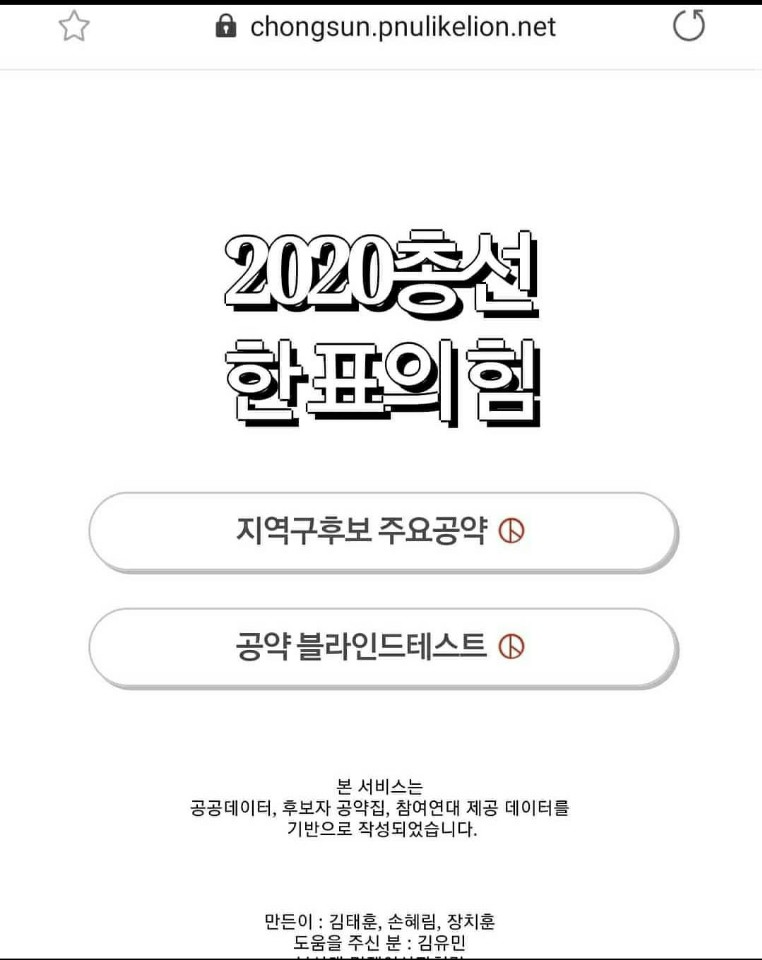

>2020년 4월 15일 치뤄진 총선 선거프로젝트 후기. 

### 아이디어의 발단

친구들과 함께 다른 일때문에 아이디어 회의를 하던중 공약쇼핑몰이라는 아이디어가 흘러가듯 나왔었다.
사실 공약쇼핑몰이라는게 지난 대선 때 한번 선보이기도 했고, 
공약이라는 부분이 한시적인 Item이지만 재밌어 보였기에,
해당 아이디어는 나중에 만들어보자 했었다.

그렇게 시간은 흘러 4월의 초입에 들어섰고.
뭔가 이 기간에 이 서비스를 만들면 사람들이 많이 이용하겠지? 하는 기대감에 시작은 했지만
기획이나 컨셉을 비롯하여 정해져있는 부분이 없어서 속절없는 시간만 흘러갔다.

***

### 아이디어의 구현

더군다나 **총선이라는 특수성**으로 인해 DATA를 가져옴에 있어서도 곧바로 들고올 수 있었던게 아니라
각 날짜별로 공개되는 DATA를 기다렸다가 공공 DATA PAI, 크롤링 해오는 방법을 이용했다.
이러한 상황으로 인해 서비스 개발이 더 지연되고 있었다.

하지만 이보다 더 발목을 잡고, 그 과정에서 많이 배운 부분이 있었다.
사실 서비스개발이라는 부분에 있어서 지금까지는 **도메인지식의 중요성**에 대해 크게 피부로 느끼지 못하고 있었다.
그냥 개발자로서 개발을 잘하면 되고(~~물론 그렇다고 잘하는 건 아니다~~), 팀원간 소통을 잘 하면 되지 않을까 하는 생각을 했었는데
이번엔 선거라는 민감한 이슈를 다루는만큼 **도메인에 대한 이해**가 선행되어야 서비스 기획부터 개발까지 그림을 그릴 수 있었다.
그리고 그러한 도메인과 사용자를 어떻게 연결하는게 좋을까 하는 고민을 했다.

우리는 다음과 같은 부분에 방점을 찍고 서비스 개발에 들어갔다.
* 기존에 언론사가 제공하는 정보와는 차별화 될 것
* 복잡하지 않게 직관적이고 미니멀한 UI,UX를 제공할것
* 정보제공에 최대한 공정성을 기할 것
  
그 결과
1. 부산지역 후보자 분야별 개인공약 제공,
2. 블라인드 정당 월드컵

두가지 기능을 담은 서비스를 배포하였는데
1번의 경우 후보자 개인의 공약들이 pdf 형태로 제공되어 손수정리하여 제공하다 보니 **부산지역으로 한정**지었다.
2번은 기존 언론사들의 경우 정당을 먼저 보여주고 공약을 제공해줘 유권자 입장에서 아무래도 정당에 먼저 눈길이 갔고,
아무리 **좋은 공약이라 할지라도 군소정당이라면 주목을 못 받는 사각지대**가 있는것 같아서 공정한기회를 부여받으면 좋겠다는 생각에 만들게 되었다

### 배포 그 후

실제 배포일은 5일 남짓한 시간이었다.

부산지역에 특화된 선거 서비스인만큼 홍보는 학교커뮤니티,DC,오픈카톡방을 통해서 진행했다.
그리고 이를 통해 여러 피드백을 받을 수 있었고, 마케팅채널의 속성에 대해서도 생각해볼 수 있었다.

일단 **마케팅 채널**에 대해서,
>개인적인 분석
우리의 서비스는 정보제공의 색깔이 아주 강하기때문에 바이럴로 퍼져나가는 것은 거의 없었다.
여타 단발적인 서비스의 경우 바이럴로 퍼져나가는 것을 보고 우리도 그러한 효과를 기대했지만 기대에는 못미쳤다.

이에 반해 부산지역 한정에 선거라는 이슈, 그리고 더해 모교 학생들이라는 관심이 더해져서인지
에브리타임을 통한 유입이 90%이상을 차지하였고 유입은 게시글이 묻힘에 따라, 선거일이 다가옴에 따라 줄어들었다.

그외에 DC나 오픈카톡을 통한 유입자체는 노출수 대비 전환율까지 정확하게 계산해 보진 않았지만 
학교커뮤니티에 비해 현저히 낮은 효과를 보였다.

이러한 결과를 통해 정보제공 vs 오락성 vs 정보제공 + 오락성, 타겟집단과의 내적 친밀감 등 여러 요소가 마케팅 채널을 유기적으로 변화시키는 요소임을 알 수 있었다.

그 다음으로 **피드백**에 대해서
우리는 주제가 선거인만큼 조심스럽게 해당 서비스를 공정하게 만드는데 집중하였다.

그런데 실제 사용자들은 정보제공이라는 목적을 위해 많은 시간을 할애하는 것을 꺼려했고,
결과적으로 블라인드 정당월드컵이 제공하는 51개 정당의 비교 프로세스를 피로해했다.

마냥 **_우리가 제공하려는 가치가 정말 사용자들이 원하는 가치였을까_**? 아니었다.
몇개의 정당으로만 추려서 월드컵을 하거나, 과정을 좀더 단순화하자는 피드백을 정말 많이 받았다.
처음에는 공정성을 지키려 했던 포인트를 사용자들이 몰라주는 것 같아서 억울하기도 했지만

이후에 사용자들이 해당 서비스를 통해 얻으려 했던 가치와 우리가 제공하려했던 가치가 달랐음을 알았고,
앞으로 어떻게 하면 좀더 좋은 서비스를 만들 수 있을까 생각하는데 밑거름이 되었다.

### 마무리

짧은 기간 개발하고 짧은 시간 배포했지만 특별한 Item을 다룬 서비스였다.
특히나 엄청 많은 분들은 아니었지만 공적인 일을 위해 개발했던 서비스인 만큼

해당 서비스를 사용해주시는 사용자분들을 보며 개발자로서 사회에 어떤식으로 기여를 할 수 있는지
세상을 변화시킬수 있는지 맛을 볼 수 있었던 뭉클한 프로젝트였다.

