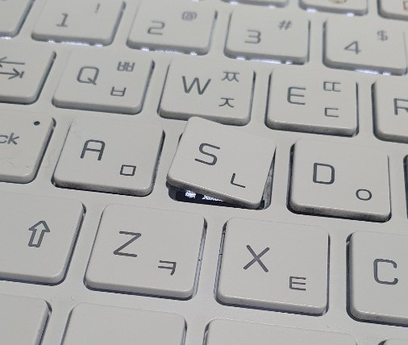
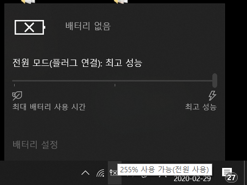
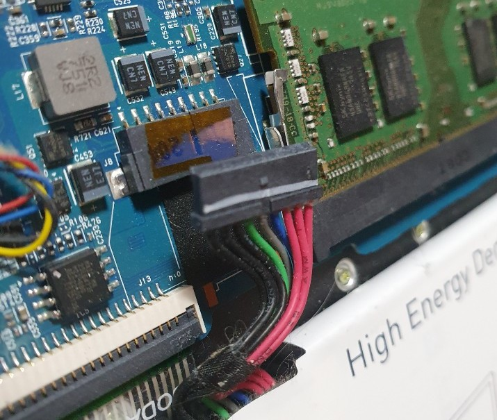

내 첫 노트북으로 함께 해오던 LG gram이 예전부터 여닫는 부분이 헐거워지더니 

저장을 많이해서인지 ㄴㄴ를 많이 해서인지 모르겠지만
기어코 s키까지 빠져버렸다. 

역시 gram은 내구성이 조금 아쉬운 것 같다 😥

서비스센터에 가서 깔끔하게 수리를 하고
집에 돌아오니 새로운 문제가 생겼다.

* 배터리 255% 사용가능
* 배터리 없음
* 충전기 분리시 전원꺼짐

위와 같은 현상이 발생했다. 
키를 고치고 왔는데 배터리문제가 생겼다고???

찾아보니 LG gram의 고유 증상은 아닌 것 같았고   
해외에서는 _' window 1909 update 이후 문제가 생겼다'_ 와 같은 글들이 보였다.

하지만 나는 1909 update를 하지않은 상태였기에 
하드웨어를 문제가 아닐까 싶었다

수리기사님의 숙제였는지
메인보드와 연결이 안되어 있었고 

연결을 해주니 해결되었다👏👏👏

>### 노트북 key가 빠졌을때
>
>키에 key 지지대가 붙어있으면 지지대를 분리하여 먼저 조심스럽게 키보드에 조립후 키를 끼워야한다.
>
>**이때 키보드에 붙은 걸쇠가 망가지면 키보드 전체를 교체해야하므로**
>
>조심스럽게 지지대를 끼우거나 혹은 가까운 AS센터로 방문하도록 하는게 좋다.