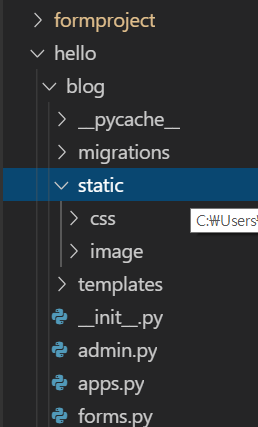
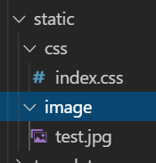

Static file과 media file을 관리하는 방법에 대해서 복습해봅시다

>🎓 잠깐 그전에 정적인 페이지와 동적인 페이지가 무엇인가요??
> 간단한 비유를 하나 해보도록 하겠습니다.
> 정적인 페이지 : 준비된 재료를 바탕으로 요리를 해주는 식당
> 동적인 페이지 : 손님이 준 재료를 가지고 요리도 해주는 식당   
> 이렇게 비유를 해드리면 이해가 쉽지않을까 합니다.
> 즉. 정적인 페이지는 우리가 준비한 file들에 대해서만 serve할수있는 반면
> 동적인 페이지는 우리가 가지고 있지 않더라도 사용자가 올린 file들도 제공해줄수 있는것이죠!

# 1. Static 폴더 준비하기

```python
project 폴더 아래 App 폴더가 있는 곳에 static 폴더를 만들어 줍시다
```



위와 같이 static 폴더를 만들어주고 지금 당장 사용할 css 와 image folder를 만들어줍시다

그리고 간단하게 



index.css와 test.jpg를 하나씩 넣어서 공부에 용이하게 준비해둡시다.

# Static 사용하기

```html
<!--사용하고자 하는 template.html-->

<!DOCTYPE html>
<html lang="en">
<head>
    <meta charset="UTF-8">
    <meta name="viewport" content="width=device-width, initial-scale=1.0">
    <meta http-equiv="X-UA-Compatible" content="ie=edge">
    <title>Document</title>
    <link rel="StyleSheet" href="">
</head>
<body>
    <h1>메인페이지</h1>
		
    <a href="">
        <h3>글쓰기페이지</h3>
    </a><!-- Create가 시작되는 부분입니다.-->
    <h3>글 목록</h3>
    
        제목 : {{i.title}} / <a href="">상세페이지</a> <br>
        내용 : {{i.body}}<br>
    <hr><Hr>
    
</body>

```

위와 같이 **__** 으로 static 파일과 폴더를 사용할수 있게 template에서 불러와줍시다.

```html
<link rel="StyleSheet" href="">
```
CSS 외부 참조방법이랑 똑같은 방법인데 대신 href 로 참조하는 주소가 
Django에서 제공해주는 template tag를 이용하여 표현한 모습입니다. 
static이라는 폴더안에 있는 css 내부의 index.css를 사용하겠다는 의미입니다.


```html

```
img가 참조할 source 주소를 장고가 제공해주는 template tag를 이용하여 
static - image - test.jpg로 나타내주고 있습니다.

그런데 이때 static 파일들이 적용이 되지 않는다면 runserver를 끄고
다시한번 runserver로 실행시켜 보세요!

# Static 관련 [settings.py](http://settings.py) 설정해보기

```python
# settings.py 맨 아랫부분에 추가하기

STATIC_URL = '/static/'

STATIC_ROOT = os.path.join(BASE_DIR, 'static')
```

- STATIC_URL : 우리의 static 요소들을 보여주기 위해
                      요청되는 URL주소입니다
- STATIC_ROOT : 나중에 실 서비스를 배포하게 될때는
app별로 흩어져 있는 우리의 static요소들을 한곳에 모아줘야합니다.
개발단계에서는 runserver를 해주면 알아서 모아주지만
배포를 할때는 위의 STATIC_ROOT의 경로로 모아서 관리를 해줍니다.
이때 모으는 명령어는 python [manage.py](http://manage.py) collectstatic이고 
(BASE_DIR, 'static') 이부분은 우리의 Project directory 밑에 static이라는 폴더라는 의미입니다.

- STATICFILES_DIR(당장은 불필요) : 우리가 나중에 개발을 하다보면 App과 무관한 Asset 을 관리해야 할 때도 발생한다. 그럴때는 STATICFILES DIR을 설정해주어 File Finder 가 찾아갈수 있도록 해줘야한다.


단 지금 개발환경에서 Static을 사용하는 수준은 위의 설정을 따로 안해줘도 무방합니다.

# Media 파일 입력받을 modelform준비하기

```python
# Models.py
class Post(models.Model):
    title = models.CharField(max_length=30)
    body = models.TextField()
    myimage = models.ImageField(default = "null")
```

- image도 form을 통해서 입력 받을수 있게 우리는 model에 field를 추가해주도록 합시다. (그리고 default값을 설정해주어 따로 image upload를 안할시 'null'이라는 값을 
       넣어주게 했습니다)

우리는 imagefield를 사용하기 위해서
python 에서 제공해주는 pillow라는 애를 써줍시다

1. pip install pillow
2. python manage.py makemigrations
3. python manage.py migrate

```python
# forms.py

class PostForm(forms.ModelForm):

    class Meta:
        model = Post
        fields = ('title','body','myimage')
```

- modelform에서 사용자들에게 받을 form의 fields에도 myimage를 추가해줍시다

# 입력 받는 form수정해주기

```html
<!--posting.html-->
...
<form method="POST" enctype="multipart/form-data">
...

```

- 우리의 글쓰기 page에서 form부분에 enctype옵션을 추가해줘
우리가 첨부하는 파일이 제대로 form을 통해서 넘어갈 수 있도록 해줍시다

# 넘어온 file을 model에 저장해주기

```python
#views.py

def posting(request):

    if request.method =="POST":
        completeform = PostForm(request.POST, request.FILES)
```

- 위와같이 modelform에 넘어온 FILES도 같이 넣어서 포장해주도록 합시다
그러면 우리의 model에 첨부한 image가 잘 저장이 되는 것을 확인 하실수 있습니다!

# Media 관련 [settings.py](http://settings.py) 수정해주기

```python
#settings.py 맨 밑에 추가해줍시다

MEDIA_URL = '/media/'

MEDIA_ROOT = os.path.join(BASE_DIR, 'media')
```

- `MEDIA_URL` : static과 비슷하게 사용자들이 media 파일들을 보기위해 요청을 하면 불러오는 URL입니다.
-` MEDIA_ROOT` : 외부에서 upload 등으로 들어오게 되는 media file들을 우리의 Project folder 밑에 있는 media라는 폴더를 만들어서 관리해주겠다는 의미입니다.

# Media file을 볼수 있는 url 처리해주기

```python
#urls.py
...
from blog import views
from django.conf import settings
from django.conf.urls.static import static

urlpatterns = [	
  ... 
	path('delete/<int:post_id>', views.delete, name="delete"),
] + static(settings.MEDIA_URL, document_root = settings.MEDIA_ROOT)
```

위처럼 `urlpatterns` 뒤에 추가적인 옵션을 적어줍니다.

쉽게 이해를 해보면 
우리가 settings.py 에 지정했던 `MEDIA_URL` 과 `MEDIA_ROOT`를 
사용해주는 건데 사용자가 `/media/ `라는 URL요청을 하면 
`MEDIA_ROOT` 위치에 저장된 media파일들을 탐색해 
사용자에게 response해준다는 의미가 됩니다.

# Modelform을 통해서 입력 받은 media file 
다시 listing해주기

```html

        제목 : {{i.title}} / <a href="">상세페이지</a> <br>
        내용 : {{i.body}}<br>
        
        이미지 : 
        
    <hr><Hr>

```
```html
 
```
img가 참조하는 source 값이 기존에 file 경로, 인터넷 URL로 되어 있던 것을 i( 글 하나하나 ) 의 myimage라는 곳에 저장되어있는 media file의 url로 적어주시면 우리의 model에 저장된 media file을 확인 하실수 있습니다

위의 경우 imagefield로 받았기에 image를 다시 보여주는 예입니다.

- 이때  를 적어준 이유는
처음부터 우리가 imagefield를 만든 모델이었으면 상관없지만 뒤늦게 imagefield를 추가해줬으므로
이전에 작성한 글에는 media file이 안 들어있는 상태입니다.
따라서 `i.myimage.url`로 불러와도 아무것도 불러올 수 없는 에러가 발생할수도 있으므로

만약 `i.myimage`의 값이 있을 경우에만 이미지를 보여줘라 라는 뜻으로 해당 `if block`을 적어줬습니다(이 방법이 아니더라도 기존 field에 default값을 설정해주셔도 무방합니다.)

이걸로 오늘의 STATIC과 MEDIA도 끝이났습니다!!!
수고많으셨습니다~~~

혹시 따라하시다가 안되시는 부분이나 제가 잘못 작성한 부분있으면 언제든지 말씀해주세요!!!
그럼 화이팅입니다🔥🔥🔥