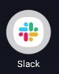
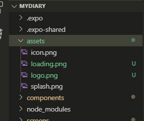
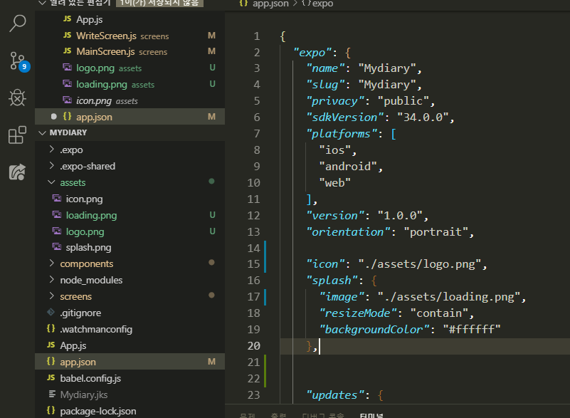
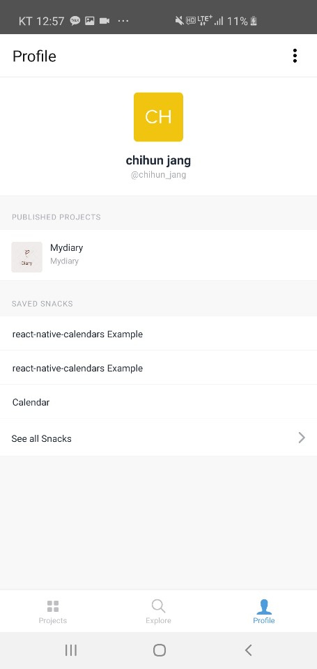

이번 시간에는 우리의 App에 Icon과 Loading화면(splash)을 부여해주도록 합시다. 아래 Icon과 Loading화면의 예시가 있습니다

### Icon

### Loading화면

\*

Logo 만들기 ( 🔻 아래의 사이트를 사용하셔도 좋고 직접 Logo를 만드셔도 됩니다! )

-   [Amazingly Simple Graphic Design Software - Canva](https://www.canva.com/)
-   [미리캔버스 디자인 페이지](https://www.miricanvas.com/design)
-   [Log In | Wix](https://www.wix.com/logo/maker/esh/dashboard/my-logos)
-   [Create Your Logo and Corporate Identity for Free Online | Logaster](https://www.logaster.com/)

저는 위의 Site중에서 Logaster에서 Logo와 Splash(Loading 화면)를 만들어오겠습니다. 🏃‍♂️

## logo

## splash

무료 버전이라 뒤에 워터마크가 같이 찍혔지만 이정도면 만족스럽습니다
그리고 우리가 만들어준 logo를 우리의 App내의 assets안에다가 넣어줍시다!!!

그리고 `app.json`으로 들어가서 적용할 icon과 splash의 file을 각각 추가한 file로 바꿔주기만 하면! 완성!!!

## 완성 모습

### Splash

### ICON

저 위에 동그라미안에 보이시죠

publish하면 expo앱에도 저렇게 뜹니당

-   background color를 통일감 있게 설정하기 위해 크롬 확장프로그램사용하기

혹시라도 splash의 크기가 작게 되면 background의 색깔과
우리의 splash간의 색깔차이가 발생 할수 있는데

그때 아래의 스포이드를 사용해주시면 같은 색으로 background color도 설정해줄 수 있습니당
[ColorZilla](https://chrome.google.com/webstore/detail/colorzilla/bhlhnicpbhignbdhedgjhgdocnmhomnp)

그럼 이번주 끝!!!
지금까지 배운것을 바탕으로 우리의 App을 좀더 App답게 만들어 나가보도록 합시다 감사합니다~😁
