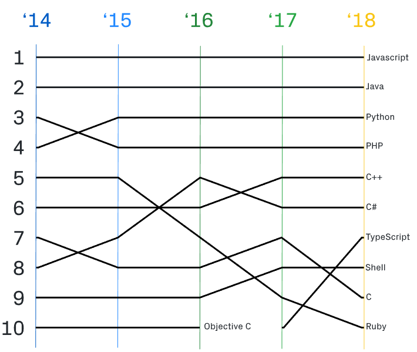

### RN 들어가기전에 JS사전지식

안녕하세요!!!

본격적으로 React-Native 에 대해 들어가기전에 React-Native의 바탕이 되는 React 의 바탕 JavaScript에 대해서 알아보도록 합시다

👀 해당 자료는 빠르고 쉬운 이해에 포커스를 맞췄습니다.
(자세한 JavaScript 자료는 나중에 꼭 공유하도록 할께요!! 필요하신 분이 계시다면..)

# JavaScript란 무엇일까?

~~(Java 랑은 다른 언어입니당 마케팅차원에서 이름을 비슷하게 지었더라는...)~~

-   움직이는 것(동적인 것)을 웹페이지에 적용할 수 있게 하는 언어
-   웹 브라우저에서 사용할 수 있는 언어 (현재 대체재가 없습니다)
-   NodeJS, 구글의 V8엔진, React Native 등 여러 분야에 활용되고 있어 Hot한 언어



GitHub에서 많이 사용하는 언어(출처 : [https://d2.naver.com/helloworld/4007447](https://d2.naver.com/helloworld/4007447))

이와 같은 인기를 반영하기라도 하는듯 하루가 다르게 라이브러리가 나오고 있어서
공부할 것도 끊이질 않아요😂

# ECMA ? JS ? ES? 용어정리

우리가 알고있는 **JavaScript** 는 사실 ECMA의 부분집합 같은 것입니다.

**JavaScript** 비슷한 친구가 더 있는데 이처럼 브라우저에서 쓰이는 언어들이

제각각이 되버리자 표준이 필요하게 되었습니다.

그래서 만들게 된것이 **_ECMAScript_**입니다.

**_ECMAScript_** : **표준화 작업**을 한 아이

**ES** : **_ECMAScript_**의 약자

따라서 우리가 소위 **JavaScript**라고 부르는 친구는 **_ECMAScript_**였다는 것을 알게 되었습니다.

(하지만 편의상 JS라고 계속 부르겠습니다)

-   ECMA 의 역사에 대해 공부하실분?

    [자바스크립트의 탄생과 ECMAScript 역사 정리](https://erokuma.tistory.com/entry/%EC%9E%90%EB%B0%94%EC%8A%A4%ED%81%AC%EB%A6%BD%ED%8A%B8%EC%9D%98-%EC%97%AD%EC%82%AC%EC%99%80-ECMAScript-%EB%8C%80%ED%95%B4?fbclid=IwAR1yJJssUWlJImlxjctfIw5tXMhPHS9JzW1Pz6dhkfTU2U8D7mFQPlV-oLY)

-   그럼 이러한 JS에 대한 공부할 준비가 되셨나요

# JS의 함수

### 생성

-   함수 선언문(리터럴) 방식 (비권장)

```jsx
function add(a, b) {
    return a + b
}

//사실 이 방법은 밑에 나올 함수표현식의 방법으로 선언한것과 같습니다
// const add = function add(a,b){ return a+b } 이런 방법으로
```

-   **함수 표현식방식(함수도 객체에 기인한 방식)**

```jsx
const add = function(a, b) {
    // 함수이름을 선언 안해줬는데 이를 익명함수라 합니다
    return a + b
}

console.log(add(1, 2)) //출력 3

//밑에서 설명을 하겠지만 add가 function 객체를 참조하는 것입니다.
```

-   생성자 이용(비권장)

```jsx
const add = new Function('a', 'b', 'return a+b')

console.log(add(1, 2)) //출력 3
```

-   생성자 함수? (몰라도 댑니당)

    만약 우리가 선언한 함수앞에 `new`를 붙이면 생성자와 같이 이용할수 있다.

    ```jsx
    const MyFunction = function (a,b){
    	this.name = a ;
    	this.age = b ;
    } ;

    const myobject = new MyFunction('likelion',7)

    myobject ==> MyFunction {name: "likelion", age: 7}

    ```

    생성자함수는 **객체를 생성**하고 리터럴 방식의 객체생성과 다르게

    함수의 **재사용으로 동일한 모양의 객체를 여러번 생성**해줄수 있다.

    이처럼 우리의 함수가 생성자처럼 사용되는것을 구별하기 위해 **첫글자를 대문자**로 한다

    이때 일반 함수 속의 **this는 전역객체**를 가리키는 반면 **생성자함수의 this는 객체**를 가리킨다

-   [ ] 지금부터는 ES6에서 추가된 주요기능들을 공부해 봅시다

# **let(변수), const (상수)**

1. **기본적으로 const(변경 불가) 를 쓰고** 그 이후에 let(변경 가능)을 사용하도록 하자
2. **const 는 선언과 초기화를 같이** 해줘야하고

```jsx
const a = 1
const a    // Error
```

3. let은 선언만 해줄 수 있습니다

```jsx
let b = 1
let b //가능
```

4. **var는 쓰지 맙시당**

-   let과 const의 차이(심화)

let과 const 둘다 객체를 참조하는데 사용될 수 있습니다

JS에서는 객체에 접근하여 property를 변경하는 것이 가능한데

```jsx
const myObject = {
a : 1,
b : 2
}

myObject.c = 3

myObject
{a: 1, b: 2, c: 3}
```

이처럼 const도 마치 변경이 가능한 것 처럼 보입니다

그래서 정확한 let과 const 의 차이는 **재 할당이 가능한지 불가능한지 여부**입니다

```jsx
const a = 객체1
let b = 객체2
```

위의 식에서 a 와 b모두 객체를 참조하고 있습니다

정확하게 말하면 a와 b는 각각의 객체가 위치한 주소저장한건데요

따라서 우리는 a 와 b를 통해 객체가 있는 곳으로 총총 따라가서 사용할 수 있게 되는 것입니다

**즉 재할당이란 a와 b에 새로운 주솟값이 저장될수 있는지 아닌지를 말하는거지**

**const가 가리키는 객체가 변경 불가능 하다의 의미는 아닙니다**

```jsx
const a = 1
a = 2 //이 경우에도 재할당이 안되는 것입니다!! 주솟값이 아닌 value값이
```

-   var와 let의 차이점(심화)

기존에 var 은 함수단위로 scope를 가지고 있었습니다. 따라서

```jsx
for (var i = 0; i < 5; i++) {
    console.log(i)
}

console.log(i) //출력값 4
```

이렇게 {} 로 묶인 블록 밖까지 i라는 애가 영향을 미치는데(구체적으로는 호이스팅)

이를 방지하기 위해 즉시실행함수로 감싸줘야 했습니다

```jsx
;(function() {
    for (var i = 0; i < 5; i++) {
        console.log(i)
    }
})()

console.log(i) // ReferenceError
```

뿐만아니라 var은 **var i = 0 이렇게**

**한번 선언 및 초기화를 해준 변수도 다시 선언과 초기화**를 해줄수 있습니다.

이와 같이 함수 단위로 scope를 가지게 되면 여기저기 variable들이 뒤죽박죽 될수 있겠죠!

하지만 **let( { },블록 단위 scope)을 사용해지면 이러한 부분에서 자유로워 질수 있습니다**

```jsx
for (let i = 0; i < 5; i++) {
    console.log(i)
}
```

그리고 **let으로 선언한뒤 다시 let 으로 선언 할수 없기에**

**재선언으로 인한 data유실을 막을 수 있습니다.**

var 이든 let이든 안 붙이면 호이스팅 되어 전역객체를 건드리게 되므로 let을 사용하도록 합시다

혹은 var를 이미 사용하고 있는 경우라면 use strict라는 장치를 이용하도록 합시다

### 모듈 사용방법(import:불러오기, export:내보내기)

모듈은 하나의 프로그램(파일)이라고 보면 됩니다

마치 브라우저에서 <script> 태그로 js 파일을 불러오는것과 비슷하죠! 혹은 css파일을 불러오거나!

모듈을 사용함으로써 우리는 코드의 재사용과 관리가 편해집니다!!

```jsx
//module.js

//방법1 선언과 동시에 export
export let a = 1;
export function myFunction(){
	...
};

//방법2 선언후 객체에 담아 export
const b = 10 ;
export {b};

//방법 3 default로 export 하기
const c = "글자";
export default c;
```

```jsx
//main.js
import my_c, {
    a,
    b,
    myfunction as myfun,
} from 'module.js의 상대경로(.js 생략가능)'
console.log(a) // 1 출력
```

위의 import를 보시면 my_c 라는 것이 생겼습니다

**default로 export해주게 되면**

**이렇게 import과정에서 기본적으로 c를 받아오고 마음에 드는 이름**으로 받아올 수 있습니다.

선언과 동시에 export한것이나 객체에 담아 export한것 모두 {}로 감싸서 받아줄 수 있습니다.

그리고 **myfunction** 의 이름을 **as myfun**으로 단순화 한것도 체크해주세요!

-   하나하나 import하기 너무 힘들다 ㅠㅠ 면?

```jsx
import * as mypack from 'module'
console.log(mypack.a) // 1 출력
```

module.js에 있는 전체 import ( \* 는 all을 의미합니다 )

# 클래스 Class

ES6(ECMA2015)부터 class 키워드가 추가되어 상속을 정의할 수있다

-   클래스란?

**속성과 행동**을 가진 모음이라고 생각해주면 됩니다

예를 들면 멋사 라는 class가 있고

우리들은 각각 멋사 class에서 파생된 객체입니다.

따라서 멋사 class가 가진 속성과 행동을 우리도 가지게 되는거죠!

추가적으로 멋사class 를 extends(상속) 하여 각 학교 class를 정의해주면

멋사class 의 속성 + 행동 , 학교class의 속성 + 행동을 가질수 있게 되는 것입니다.

### Class 의 모양

```jsx
class MyClass extends ParentClass {
    constructor() {
        super() // 부모 생성자를 호출
    }
    method() {}
}
```

Class이름은 **PascalCase 로 단어 앞글자를 대문자로 작성**해줍니다

extends 는 상속할 Class를 나타내며 일반적으로 부모Class라고 합니다

constructor는 Class가 만들어질때 호출되며 **클래스가 가지는 속성의 초깃값을 할당**해 줄 수 있슴다

**method는 function의 모양**으로 작성됩니다

이미 다른언어를 공부하셔서 Class의 개념에 대해 알고 계신 분들은 이해하기 쉬우실 거에요

하지만 **Class가 처음이다! 하시는 분들도**

위의 class구조에 대해 간단하게라도 알고계시면

나중에 react-native code 를 보실때 많은 도움이 될것을 장담합니다.

# this (~~이것~~)

**객체 내에서 this를 선언하여 호출 하게 되면 객체를** 가리키지만

```jsx
const myOb3 = {
    name: 'good',
    foo: function() {
        console.log(this.name)
    },
}

myOb3.foo() // good 출력
```

**함수에서 호출되면 전역객체를** 가리킨다

```jsx
window.name = 'likeion'
const mytest6 = function() {
    console.log(this.name)
}

mytest6() // likeion 출력
```

따라서 따로 **binding**을 해줘야한다

-   원래는 어떻게 해주는건가요?

(일반적으로 내부함수에서 binding은 that이라 통칭되는 애를 사용해서 해줬었다.
궁금하신 분들께서는 검색을 해보시구 모르시겠다면 문의주십시어)

# 화살표함수 arrow function 지원(간결한코드,바인딩)

원래 함수와 비교하며 살펴봅시다

```jsx
const origin_fun = function(a, b) {
    return a + b
}

const arr_fun = (a, b) => {
    return a + b
}
```

위의 코드와 같이 화살표 함수는 기존의 function보다 더 간결한 코드를 제공합니다

-   Arrow function의 Binding

바인딩이란 쉽게 생각하면 묶는거라고 생각할 수 있습니당

앞의 **this에서 살펴 본것처럼** **객체 내의 this는 객체를** 가리키지만

**함수 내의 this는 기본적으로 전역객체(window)**를 가리키고 있습니다.

특히 이런 현상은 내부함수(함수안에 함수가 있는거 )에서 더 잘 볼수 있는데

```jsx
window.name = 'likeion'

const myObject = {
    name: 'object',
    object_fun: function() {
        //JS 는 함수도 객체로 취급한다
        console.log(this.name) //여기서 this는 object를 가리킨다

        ;(function() {
            console.log(this.name)
        })() //함수 내부에 함수를 익명함수,즉시실행함수로 작성
    }, //여기 this는 likelion을 가진다.
}
myObject.object_fun()

//출력값
;('object')
;('likelion')
```

이처럼 객체 내에 **method로 정의된 함수에서 사용되는 this 는 해당 객체를** 가리키지만

method내의 함수 혹은 함수내의 함수의 this는 전역(window)객체를 가리킵니다

따라서

```jsx
window.name = "likeion"

const myObject = {
name :"object",
object_fun : function(){
console.log(this.name);

(**() =>** {                        //화살표 함수로 내부 함수 작성
    console.log(this.name);})()
}
};
myObject.object_fun()

//출력값
"object"
"object"
```

위와 같이 작성해주게 되면 **this는 둘러싸고 있는 한단계 위의 this(객체)와 binding**된다.

(그래서 method를 화살표함수로 작성하면 this가 한단계 위인 전역객체로 binding된다)
