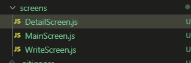
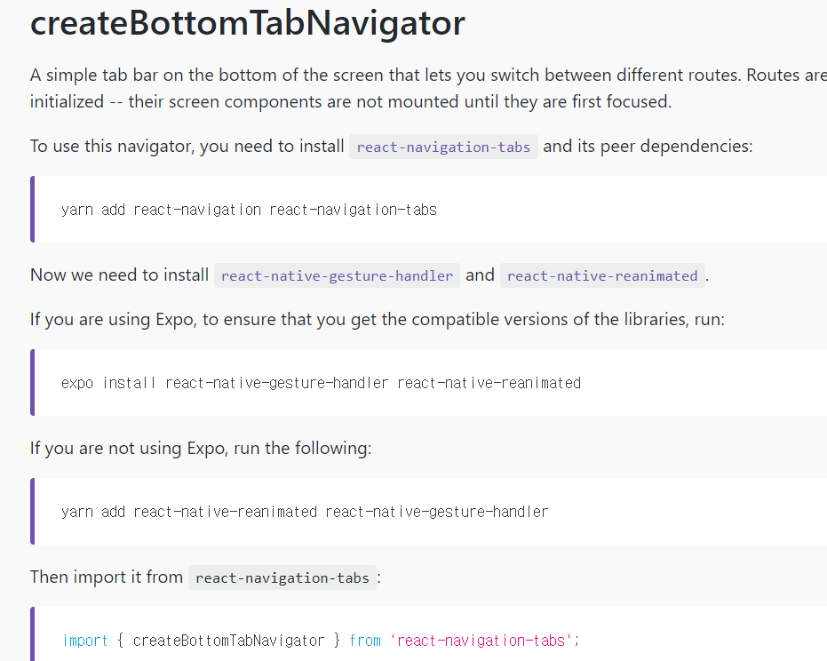
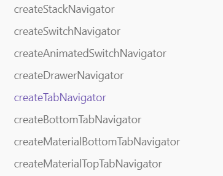
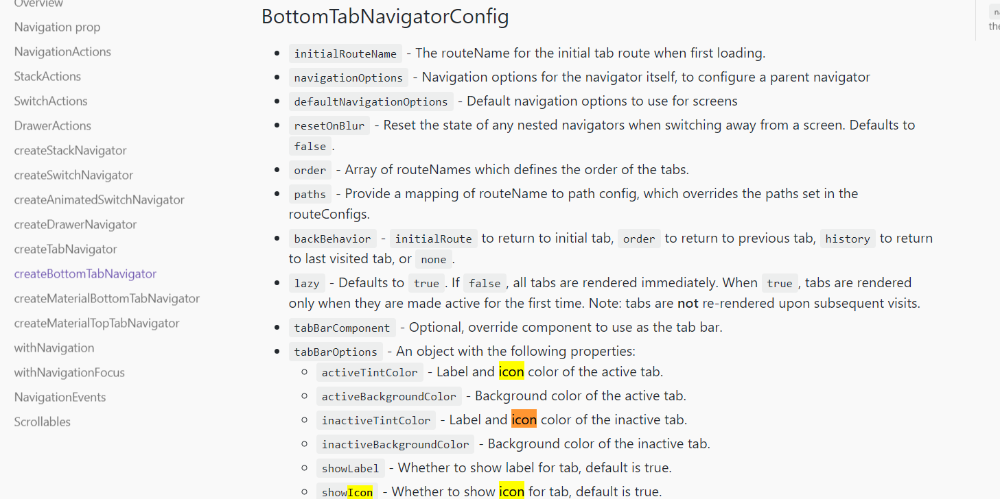
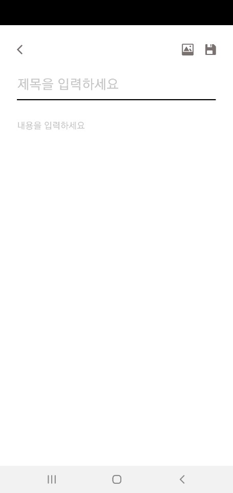

### 8 RN Diary App 의 Layout만들기

멋-하
TodoApp으로 기본적인 RN의 구조에 대해서 공부하고
Weather App으로 API를 적용하는 방법을 공부하고
오늘은 Diary App을 통해 RN을 좀더 깊이 알아보도록 하겠습니다

---

# 0.0 App 생성하기

이제는 조금 익숙해지셨을거라 생각합니다

```shell
create-react-native-app <DiaryAppName>
```

---

# 1. Navigation 만들기

Navigation은 어렵게 설명하면 app의 page간에 연결을 해주고 HTML에서의 `<a>` 태그와 같아요

쉽게 설명하면 ↆ 아래와 같은 Tab들이라고 생각해주셔도 좋습니다


그럼 일단 오늘 우리가 만들 App의 모양을 보며 Component들을 만들어볼께요
우리의 Navigation이 움직일 Screen을 만들어줘야합니다

아래에 보시면 Calendar가 있는 Page (MainPage)
책을 펼친듯한 Page==일기 내용보는 Page (DetailPage)
글쓰는 Page (WritePage)

이렇게 3개의 Page를Screens라는 폴더를 만들어서 담아둡시다



Screen은 그냥 이름을 저렇게 지어준거에요


그리고 각각의 Screen을 아주 기초적이게 준비해놓읍시다

```jsx
//WriteScreen.js
import React from 'react'
import { Text, StyleSheet } from 'react-native'
import { SafeAreaView } from 'react-navigation'

export default WriteScreen = () => {
    return (
        <SafeAreaView style={styles.container}>
            <Text style={styles.fontcontainer}>WriteScreen</Text>
        </SafeAreaView>
    )
}
const styles = StyleSheet.create({
    container: {
        flex: 1,
        backgroundColor: 'green',
        alignItems: 'center',
        justifyContent: 'center',
    },
    fontcontainer: {
        fontSize: 30,
    },
})
```

`<SafeAreaView>`: 모바일 기기마다 렌더링 되지 않을수 있는 부분 예를들면
아이폰 X의 노치부분에 우리의 component가 렌더링 되지 않게 하는 역할 입니다.

이제 보여줄 Screen은 준비했으니 Screen을 navigation에 연결해주면 됩니다
navigation을 새로운 File로 빼내어 Component를 분리해도 되지만
저는 그냥 `app.js`안에다가 navigation을 만들어주도록 하겠습니다

이곳에서 우리가 사용할 API들을 가져올꺼에요
[API Reference · React Navigation](https://reactnavigation.org/docs/en/api-reference.html)

RN 이 기본적으로 제공해주는 애도 아니고 expo가 제공해주는 애도 아니니까
우리는 install을 해야지 React Navigation을 사용할수 있습니다

아래와 같이 입력을 해주시면 설치가 완료되는데요!

```jsx
npm install --save react-navigation react-native-gesture-handler
```

-   혹시라도 사용하다가 navigation을 사용할수 없다 이런 Error가 뜨면
    아래와 같이 Navigator API doc에 어떻게 설치를 하고 import를 하는지 나와있으니
    빼먹은 것은 없는지 체크하셔서 설치해주시면 되겠습니다.
    `yarn` 명령어가 안먹으면 `npm install` 을 사용해주시면 되겠습니다
    
-   그래두 react-navigation이 4.0 이상 버전으로 update되면서 설치해야할것을 적어보면

```shell
expo install react-navigation
            react-native-gesture-handler
            react-native-reanimated
            react-native-screens
# 그리고 각자 사용하는 navigator 까지 설치해줍시다
expo install react-navigation-stack
#expo라는 명령어가 안먹으면 npm install, yarn add 등을 사용하셔도 무방합니다
```

우리는 아래의 많은 Navigator중에서 `BottomTabNavigator`를 사용해볼껍니다


```jsx
//App.js

import React from 'react'
import { StyleSheet, Text, View } from 'react-native'
import { createBottomTabNavigator, createAppContainer } from 'react-navigation'
import MainScreen from './screens/MainScreen'
import DetailScreen from './screens/DetailScreen'
import WriteScreen from './screens/WriteScreen'

//BottomTabNavigator를 생성합니다. (이름처럼 아래부분에 탭을 통해 이동하는 Navigator입니다)
const BaseNavi = createBottomTabNavigator({
    //MainScreen이라는 이름의 tab item을 만듭니다
    MainScreen: {
        //Tab을 하면 띄워줄 screenㅇ로 MainScreen을 설정합니다
        screen: MainScreen,
    },
    DetailScreen: {
        screen: DetailScreen,
    },
    WriteScreen: {
        screen: WriteScreen,
    },
})

//App.js에서 Navigation을 사용하려면 createAppContainer을 이용해
//최상위 Navigation을 처리 해줘야 합니다. 지금은 BaseNavi하나이므로 BaseNavi를 처리해줍시다
const MyNavi = createAppContainer(BaseNavi)

export default class App extends React.Component {
    render() {
        return (
            <View style={styles.container}>
                <MyNavi />
            </View>
        )
    }
}

const styles = StyleSheet.create({
    container: {
        flex: 1,
        backgroundColor: '#fff',
        //여기 정렬되어있는애들 지워야지 우리의 bottomnavi가 제대로 보입니다
    },
})
```

`createAppcontainer`는 최상위 Navigator를 App과 연결해주는 역할을 하는 애입니다
위의 코드에서 우리는 `react-navigation`에서 navigator를 가져와서 우리가 만들었던 screen을 등록하고 `Appcontainer`로 App에 연결을 해 component로 사용해주고 있습니다.

실행시켜보면 우리의 기기 하단에 Navigator가 생긴것을 알 수 있습니다.

-   💥💥💥 createBottomTabNavigator 와 앞으로 나올 StackNavigator관련 issue

아래 보시면 각각의 navigator들이 from으로 부터 가져오는 곳이 달라졌습니다.
에러가 발생하시면 참고해서 작성해주세요 ㅠㅠ

그럼에도 unable resolve 가 뜨면 위에서 소개해드린 site로 찾아가서
해당부분을 install 해주시면 되겠습니다

---

## 그럼 우리 이제 Navigator에 Icon을 먹여보도록 합시다

### 방법 1 : Screen 을 class compo 로 만든다음 후 static선언 이용

(물론 Icon을 사용하니까 import는 각각 해주셔야 합니다!)

```jsx
//WriteScreen.js

export default class WriteScreen extends React.Component {
    static navigationOptions = {
        tabBarIcon: ({ tintColor }) => ( //tintColor라는 Props를 받아와 사용해줍니다.
																				 //tintColor는 눌렀을때 색깔변화를 나타내기 위해 가져와줬습니다.
            <MaterialCommunityIcons name='calendar-multiselect' size={25} style={{ color: tintColor }} />
        )
    }
```

Static은 해당 Class가 생성되면서 자동으로 만들어지는 변수인데 default props로 전달된다고 생각해주시면 댑니다.

우리의 WriteScreen 이 보여진다 → WriteScreen instance가 만들어졌다 →
default로 navigationOptions를 가지고 있다. 이렇게요!

---

### 방법2 : navigator 안에다가 option으로 Icon을 집어 넣는 방법입니다.

(물론 Icon을 사용하니까 import는 각각 해주셔야 합니다!)

```jsx
//App.js

MainScreen: {
    screen: MainScreen,
    navigationOptions : {
      tabBarIcon: ({ tintColor }) => (
        <MaterialCommunityIcons name='calendar-multiselect' size={25} style={{ color: tintColor }} />
      )
    },
  },
},
```

그리고 이렇게 Icon 을 추가해주면 기본적으로 우리가 가지고 있는
navigator의 label값과 더불어 나타나므로

추가적으로 tabBarOption의 `showlabel`속성까지 수정해줍시다.

```jsx
MainScreen: {
    //탭의 화면은 ListScreen을 사용합니다.
    screen: MainScreen,
    navigationOptions : {
      tabBarIcon: ({ tintColor }) => (
        <MaterialCommunityIcons name='calendar-multiselect' size={25} style={{ color: tintColor }} />
      )
    },
  },
{
  tabBarOptions:{
    showLabel :false,
  }
}
```

여기서 주의해야 할것은

```jsx
createBottomTabNavigator({screen object} , {tabBarOptions} ) 괄호에 유의해주세요
```

그럼 Navigation은 다만들었죠?

지금부터는 각각의 Screen을 한번 꾸며봅시다

-   Navigator가 가질수 있는 Option은 어떻게 아나요??

아래 Page의 밑부분에 보시면 Config부분이 있습니다.
[createBottomTabNavigator · React Navigation](https://reactnavigation.org/docs/en/bottom-tab-navigator.html)



---

# 2. WriteScreen 꾸며주기

지금 기존의 BottomTabNavi를 통해서 우리는 각각의 Screen을 왔다 갔다 할 수 있었습니다
충분한거 같지만 우리는 배우는걸 좋아하고..(?) 또 글쓰기는 뭔가 다른 효과가 나타났으면 좋겠으니 새로운 Navigator를 들고와서 기존의 BottomTabNavi과 합쳐보도록 하겠습니다

새로 들고올 createStackNav를 App.js에 작성해주도록 할께요

```jsx
//App.js
import {createBottomTabNavigator,createStackNavigator,createAppContainer} from 'react-navigation';

const BaseNavi = createBottomTabNavigator({

  MainScreen: {
    screen: MainScreen,
  },
  DetailScreen: {
    screen: DetailScreen,
  },
	WriteScreen: {
    screen: WriteScreen,
	},
},
{
	tabBarOptions:{
    showLabel :false,
  }
}
);

const BaseNavi2 = createStackNavigator( //Navigator를 만드는 방법은 BottomTab과 다르지 않죠?
  {
    Write : WriteScreen,   //Write라는 이름이 사용되면 WriteScreen을 사용해주겠다
    Tab: BaseNavi,         //Tab이라는 이름이 사용되면 우리가 만들었던 TabNavi를 사용해주겠다
    Detail : DetailScreen, //나중에 detailpage도 stack방식의 navi로 이동해줄예정입니다.
  },
  {
    initialRouteName:'Tab', // 처음 보여줄 Page라고 생각하시면 되겠습니다 지금은 Tab이니까 TabNavi의 첫번째 Main이 떠요

    mode : 'modal' // IOS의 경우 stack되는 모양을 card 와 modal 둘중 하나로 설정할수있슴다. 안드로이드는 무시해도 돼요
    headerMode : 'none' //headermode를설정 안하시고 동작시켜보면 알겠지만 stack된 screen위에
  }                     //header가 생긴 것을 볼수 있어요. 그 header에 뒤로가기가 있는데
                        //우리는 따로 header를 만들어 줄 예정이므로 'none'설정을 해줍시다
)

const MyNavi = createAppContainer(BaseNavi2)
```

-   위에서 우리가 `stackNavigator`를 만들때 설정해 준 것처럼 headermode를 사용하거나
-   뒤로가기 버튼을 통해서 stack navigator로 옮겨간 screen에서 빠져나올수 있는데

우리는 이런 부분을 해결하고 다른 기능을 추가하기 위해 WriteHeader를 작성해 WriteScreen에 얹어주도록 하겠습니다.

component라는 directory를 만들어거 우리가 만들 부품들을 넣어주도록 하겠습니다

```jsx
//WriteHeader.js

import React from 'react'
import { View, TouchableOpacity, StyleSheet } from 'react-native'
import { withNavigation } from 'react-navigation'
import { Ionicons } from '@expo/vector-icons'

const WriteHeader = ({ navigation }) => {
    return (
        <View style={styles.container}>
            <TouchableOpacity
                onPress={() => {
                    navigation.goBack()
                }}
                hitSlop={{ top: 32, bottom: 32, left: 32, right: 32 }}
            >
                <Ionicons name="ios-arrow-back" size={25} />
            </TouchableOpacity>

            <View style={styles.iconContainer}>
                <TouchableOpacity
                    hitSlop={{ top: 2, bottom: 2, left: 2, right: 2 }}
                >
                    <Ionicons name="ios-image" size={25} />
                </TouchableOpacity>
                <TouchableOpacity
                    hitSlop={{ top: 2, bottom: 2, left: 2, right: 2 }}
                >
                    <Ionicons name="ios-save" size={25} />
                </TouchableOpacity>
            </View>
        </View>
    )
}

const styles = StyleSheet.create({
    container: {
        flexDirection: 'row',
        alignItems: 'center',
        justifyContent: 'space-between',
    },
    iconContainer: {
        flexDirection: 'row',
        width: 60,
        justifyContent: 'space-between',
    },
})

export default withNavigation(WriteHeader)
```

위의 코드를 보면 기존에 우리가 작성했던 Touchable Component와 비슷한 모양입니다

-   `hitSlop` : touch를 인식하는 touch box의 크기를 설정합니다

-   `withNavigation` : 우리의 `WriteHeader`는 `WriteScreen`과 달리 직접적으로 Navigator와 엮여있지 않습니다. 그래서 우리는 `WriteScreen`의 하위 Component인 `WriteHeader`도 Navigation의 기능을 일부 사용할수 있게`withNavigation`으로 묶어주면서

상위 Component인 `WriteScreen`이 가진 특성을 함수형 컴포의 Props로 받아오면서
`navigation.goBack()`과 같은 메서드를 이용할 수 있게 되는 것입니다.
그리고 우리가 보여주고 싶은 `WriteScreen`을 조금 수정해보도록 할께요

-   글쓰기 component
    WriteScreen에 들어가야할 내용은 WirteHeader 정도가 되겠습니다

```jsx
//WriteScreen.js

import React from 'react'
import { TextInput, StyleSheet, Dimensions, View } from 'react-native'
import { SafeAreaView } from 'react-navigation'
import { MaterialCommunityIcons } from '@expo/vector-icons'
import WriteHeader from '../components/WriteHeader'

const { width, height } = Dimensions.get('window')

export default class WriteScreen extends React.Component {
    static navigationOptions = {
        tabBarIcon: ({ tintColor }) => (
            <MaterialCommunityIcons
                name="lead-pencil"
                size={25}
                style={{ color: tintColor }}
            />
        ),
        tabBarOnPress: ({ navigation }) => {
            navigation.navigate('Write')
        },
    }
    render() {
        return (
            <SafeAreaView style={styles.container}>
                <View style={styles.contentContainer}>
                    <WriteHeader />
                    <TextInput
                        placeholder="제목을 입력하세요"
                        style={styles.title}
                        returnKeyType="done"
                    /> //TextInput을 끝낼 key의 type을 결정합니다 //이경우에는 확인버튼
                    <TextInput
                        placeholder="내용을 입력하세요"
                        multiline={true} //여러줄에 걸친 입력이 가능합니다
                        style={styles.content}
                        returnKeyType="done"
                    />
                </View>
            </SafeAreaView>
        )
    }
}
const styles = StyleSheet.create({
    container: {
        flex: 1,
        alignItems: 'center',
        paddingTop: 30,
    },
    contentContainer: {
        width: width - 60,
    },
    title: {
        marginVertical: 30, //margin을 위 아래로 주는 속성입니다
        fontSize: 30,
        paddingBottom: 12,
        borderBottomWidth: 2,
    },
    content: {
        fontSize: 20,
    },
})
```

그럼 우리의 WriteScreen이 만들어졌습니다!!

그럼 이제 MainScreen을 꾸며보도록 합시다!

# 3. MainScreen 꾸며주기

우리는 MainScreen에서 Calendar를 가져와서 사용할 예정입니다.
그런데 expo가 제공해주는 calendar가 아니라 외부의 calendar를 가져와서 사용할거라서
이번에도 설치부터 해줘야합니다!!


아래의 링크를 보시면 설치부터 사용까지 설명이 잘되어있는데요!

[react-native-calendars](https://www.npmjs.com/package/react-native-calendars)

따라해봅시다

```shell
npm install --save react-native-calendars
```

```jsx
//MainScreen.js
import { Calendar } from 'react-native-calendars';

export default class MainScreen extends React.Component {
    static navigationOptions = {
        tabBarIcon: ({ tintColor }) => (
            <MaterialCommunityIcons name='calendar-multiselect' size={25} style={{ color: tintColor }} />
        )
    }
    render(){
        return (
            <SafeAreaView style={styles.container}>
                <Calendar current={new Date()} /> //Calendar의 Props로 현재 날짜를 new Date()라는 생성자를 이용해 넘겨줍니다
            </SafeAreaView>
        )
    }
}
const styles = StyleSheet.create({
    container: {
        flex: 1,
        paddingTop:50,
		    //여기서 가운데 정렬 속성을 없애줘야지 우리의 Calendar가 이쁘게 위에서 부터 뜨게 됩니다!
	      //아니면 여러분의 취향에 맞게끔 위치를 옮겨주셔도 좋아요!
    },
```

위와 같이 작성을 해주시면 기본적인 Calendar가 생성됩니다

## 다른 Calendar library사용하기

### react-native-calendar-picker 설치

-   리액트 네이티브에서 쉽게 캘린더를 사용할 수 있게 해주는 모듈입니다.
-   moment.js를 기반으로 하기 때문에 moment도 함께 설치합니다.

```bash
npm install moment react-native-calendar-picker --save
```

[react-native-calendar-picker](https://www.npmjs.com/package/react-native-calendar-picker)

calendar도 RN이나 expo가 기본 제공해주는게 아니므로 추가 설치해줘야해요

```jsx
//ListScreen.js

import React from 'react';
import { Text,View
import {SafeAreaView} from 'react-navigation';
import CalendarPicker from 'react-native-calendar-picker';

export default ListScreen = () => {
    return (
        <SafeAreaView>
            <CalendarPicker/>
        </SafeAreaView>
    );
}
```

Calendar까지 생성했는데 위의 캡쳐본에서 보시면 작성한 일기가 아래에 List의 형태로 뜨잖아요??

지금은 기능적인 부분은 제외하고 임시로 State를 만들어서 List 띄워주는 부분을 구현해보도록 합시다

그럼 App.js 에서 State를 가질수도 있는데 우리는 MainScreen에서 State를 띄워 주는 연습을 해보도록 하겠습니다

```jsx
//MainScreen
import React from 'react'
import {
    StyleSheet,
    Text,
    View,
    ScrollView,
    FlatList,
    TouchableOpacity,
} from 'react-native'
import { SafeAreaView } from 'react-navigation'
import { MaterialCommunityIcons } from '@expo/vector-icons'
import { Calendar } from 'react-native-calendars'

export default class MainScreen extends React.Component {
    static navigationOptions = {
        tabBarIcon: ({ tintColor }) => (
            <MaterialCommunityIcons
                name="calendar-multiselect"
                size={30}
                style={{ color: tintColor }}
            />
        ),
    }
    //우리가 일기로 사용항 data를 몇개 작성해놓습니다
    state = {
        selectedDate: '',
        Posts: [
            {
                title: '8월 30일에 쓴 글',
                content: '본문',
                date: '2019-08-30',
            },
            {
                title: '8월 29일에 쓴 글',
                content: '본문',
                date: '2019-08-29',
            },
        ],
    }

    render() {
        return (
            console.log(this.state.selectedDate), //제대로 찍히고 있는지 확인하기 위한용도입니다
            (
                <SafeAreaView style={styles.container}>
                    <Calendar
                        onDayPress={day => {
                            this.setState((this.state.selectedDate = day))
                        }}
                        current={new Date()}
                    />
                    <ScrollView>
                        <FlatList
                            data={this.state.Posts.filter(data => {
                                return (
                                    data.date ==
                                    this.state.selectedDate.dateString
                                )
                            })}
                            renderItem={({ item, index }) => {
                                return (
                                    <TouchableOpacity style={styles.listitem}>
                                        <View>
                                            <Text style={styles.listtext}>
                                                제목 : {item.title}
                                            </Text>
                                            <Text style={styles.listtext}>
                                                내용 : {item.content}
                                            </Text>
                                        </View>
                                    </TouchableOpacity>
                                )
                            }}
                            keyExtractor={(item, index) => {
                                return `$(index)`
                            }}
                        />
                    </ScrollView>
                </SafeAreaView>
            )
        )
    }
}
const styles = StyleSheet.create({
    listitem: {
        marginLeft: 50,
        marginTop: 20,
        borderLeftColor: 'black',
        borderLeftWidth: 4,
        paddingLeft: 30,
    },

    container: {
        flex: 1,
        paddingTop: 50,
    },
    textstyle: {
        fontSize: 40,
    },
    listtext: {
        fontSize: 20,
    },
})
```

위에서 눈여겨 볼만한 애들을 알아보도록 해요

-   `state` : 우리는 특정 날짜를 선택하여 일기를 작성하고, 특정날짜를 선택했을때 작성한 일기가 보이도록 하고싶으므로 `selected date`값과 일기의 내용으로 들어가야할 기본 정보를 Posts 안에 Array의 형태로 넣어주겠습니다.
-   `onDayPress={(day) => { this.setState(this.state.selectedDate = day)} }`
    Calendar 의 option에 보면 특정 날짜를 눌렀을때 day 객체를 받아오는데 해당 day를 `setState`를 이용해 `selectedDate`에 할당하는 모습입니다

```jsx
day객체의 모양
Object {
    "dateString": "2019-08-30",
    "day": 30,
    "month": 8,
    "timestamp": 1567123200000,
    "year": 2019,
}
```

-   `ScrollView` : 말그래도 내부 하위 Component들의 길이가 길어지면 Scroll형태로 보여줌
-   `data ={this.state.Posts.filter(data => { return data.date == this.state.selectedDate.dateString })}`

FlatList의 data로는 기본적으로 Array의 모양이 올수있는데
Posts라는 Array에 filter method를 이용해 data로 받은 array에서 date 가
우리의 state의 selectedDate 의 dateString과 같은 애들만 array로 return해줄 수 있도록 해요

이때 우리가 받은 selectedDate는 객체이므로 dateString이라는 key값으로 YYYY-MM-DD모양을 대조해줍니다.(그래서 state를 미리 작성해 놓았을때 YYYY-MM-DD모양으로 작성했습니다)

> filter method  
> [Array.prototype.filter()](https://developer.mozilla.org/ko/docs/Web/JavaScript/Reference/Global_Objects/Array/filter)

위와 같이 작성해주면 우리의 MainPage가 꾸며진것을 볼수 있습니다!
그럼 이제 마지막으로 detail page를 작성해보도록 합시다

# 4. Deatil Screen만들어주기

일단 Detail Screen으로 이동을 하려면 우리가 궁금해하는 일기를 클릭했을때 이동이 일어나야 해요
따라서 우리가 StackNavi를 만들때 미리 설정해두었던 Detail이라는 사용하도록 하겠습니다

일단 우리의 일기 list의 item을 클릭했을때 detail screen으로 이동하면 좋겠으니
MainScreen의 list item 부분을 조금 수정해 주도록 합시다

```jsx
//MainScreen.js

<ScrollView>
    <FlatList
      data ={this.state.Posts.filter(data => { return data.date == this.state.selectedDate.dateString })}
      renderItem ={({item, index})=>{
          return (
              <TouchableOpacity
                onPress={() => {this.props.navigation.navigate('Detail',{post:item})}}
```

-   `onPress={() => {this.props.navigation.navigate('Detail',{post:item})}}`
    `Touchable component`를 누르게 되면 우리의 `MainScreen`이 전해받는 `navigation props`의 navigation에서 navigate method를 이용해 `Detail`이라는 이름의 Screen을 띄워줍니다
    그리구 `post`라는 이름(key)으로 `item`을 넘겨줍니다.  
    이때 item은 `renderItem` 에 의해서 array를 하나하나 돌고있으므로 list로 띄워준 item이에요  
    그리고 우리의 detail page 또한 `stackNavi`로 이동했으므로 detail Screen용 header를 하나 만듭시다  
    위에서 만들었던 `WriteHeader`와 비슷하니까 WriteHeader를 가져와서 조금만 수정해주면 됩니다!

```jsx
//DetailHeader .js

import React from 'react'
import { View, TouchableOpacity, StyleSheet, Dimensions } from 'react-native'
import { withNavigation } from 'react-navigation'
import { Ionicons } from '@expo/vector-icons'

const { width, height } = Dimensions.get('window')

const DetailHeader = ({ navigation }) => {
    return (
        <View style={styles.header}>
            <View style={styles.container}>
                <TouchableOpacity
                    activeOpacity={0.8}
                    onPress={() => {
                        navigation.goBack()
                    }}
                    hitSlop={{ top: 32, bottom: 32, left: 32, right: 32 }}
                >
                    <Ionicons
                        name="ios-arrow-back"
                        size={25}
                        color={'#7a7171'}
                    />
                </TouchableOpacity>

                <TouchableOpacity
                    activeOpacity={0.8}
                    hitSlop={{ top: 2, bottom: 2, left: 2, right: 2 }}
                >
                    <Ionicons name="ios-close" size={25} color={'#7a7171'} />
                </TouchableOpacity>
            </View>
        </View>
    )
}

const styles = StyleSheet.create({
    header: {
        alignItems: 'center',
    },
    container: {
        flexDirection: 'row',
        alignItems: 'center',
        justifyContent: 'space-between',
        width: width - 50,
    },
})

export default withNavigation(DetailHeader)
```

그리고 `DeatailScreen`을 꾸며주도록 합시다!

```jsx
//DetailScreen.js

import React from 'react'
import { StyleSheet, Text, View, Dimensions } from 'react-native'
import { SafeAreaView } from 'react-navigation'
import { MaterialCommunityIcons } from '@expo/vector-icons'
import DetailHeader from '../components/DetailHeader'
import NullPage from '../components/NullPage'

const { width, height } = Dimensions.get('window')

export default class DetailScreen extends React.Component {
    static navigationOptions = {
        tabBarIcon: ({ tintColor }) => (
            <MaterialCommunityIcons
                name="book-open-page-variant"
                size={30}
                color={tintColor}
            />
        ),
    }

    post = this.props.navigation.getParam('post')

    render() {
        return (
            <SafeAreaView style={styles.container}>
                <DetailHeader />
                {this.post ? (
                    <View>
                        <View style={styles.detailbox}>
                            <Text style={styles.detailtitle}>
                                제목 : {this.post.title}
                            </Text>
                        </View>
                        <View style={styles.detailbox}>
                            <Text style={styles.detailcontent}>
                                내용 : {this.post.content}
                            </Text>
                        </View>
                    </View>
                ) : (
                    <NullPage />
                )}
            </SafeAreaView>
        )
    }
}

const styles = StyleSheet.create({
    container: {
        flex: 1,
        paddingTop: 50,
    },
    textstyle: {
        fontSize: 40,
    },

    detailbox: {
        marginVertical: 30,
        marginLeft: 30,
        borderLeftColor: 'grey',
        borderLeftWidth: 5,
        paddingLeft: 20,
    },
    detailtitle: {
        fontSize: 40,
    },
    detailcontent: {
        fontSize: 20,
    },
})
```

-   위에서 보면 우리가 MainScreen에서
    `onPress={() => {this.props.navigation.navigate('Detail',{post:item})}}` 로 넘겨준 값을 `post = this.props.navigation.getParam('post')` getParam method를 이용해서 post라는 이름으로 넘어온 값을 가져와 post에다가 저장해주고 있습니다

-   `{this.post?` 이부분은 예전에 한번 썼던 삼항연산자로

*   post가 있으면 == MainScreen에서 post를 넘겨줬으면 == post내용으로 compo를 만들어주고
*   post가 없으면 == <NullPage/> 를 render해라는 의미입니다

<NullPage/> 를 사용안하고 그냥 null 이라고만 작성하면 해당 화면에 아무것도 뜨지 않는데 저는 그냥 NullPage Compo를 이용해서 희미하게 안내를 해주도록 했습니다.

-   NullPage component준비하기

```jsx
import React from 'react'
import { StyleSheet, View, Text } from 'react-native'

export default function NullPage() {
    return (
        <View style={styles.nullbox}>
            <Text style={styles.nulltext}> 일기를 선택해주세요 </Text>
        </View>
    )
}

const styles = StyleSheet.create({
    nullbox: {
        alignItems: 'center',
        justifyContent: 'center',
        flex: 1,
    },
    nulltext: {
        fontSize: 30,
        color: 'lightgrey',
    },
})
```

그럼 우리의 `DeatailScreen`까지 작성이 완료되었습니다!

`MainScreen`에서 일기를 선택해서 넘어감
`BottomTabNavi`를 통해 선택 안하고 `DetailScreen`으로 넘어감


다소 어려울수도 있는 내용 끝까지 봐주셔서 감사합니다. 포기하지말고 차근차근 하시면
머릿속에 구조가 그려지실꺼에요!! 그러니 화이팅입니다

참 그리고 내용 관련 문의사항은 언제든지 해주세요!
