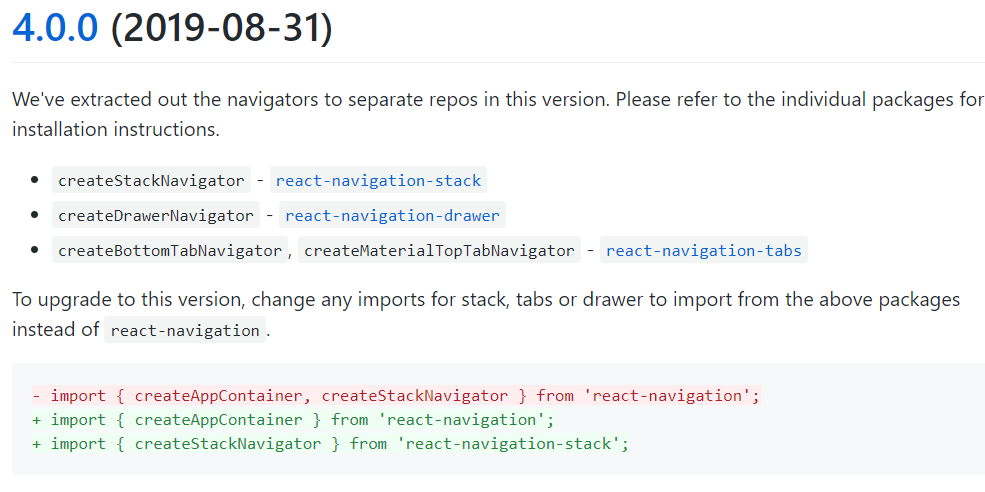

안녕하세요!

지난 시간 Navigation이라는 애를 추가하고 Calendar도 가져와서 사용한다고 많이 힘들었죠 😥이번시간에 기능만 조금더 넣어주면 Diary App이 완성되니까 달려봅시다

참 들어가기전 Diary의 Navigator를 사용함에 있어서 한가지 업데이트가 있었는데요
기존에 `createBottomTabNavigator`를 사용하거나 `craeteStackNavigator`를 사용할때
`react-navigation` 에서 가져와 사용해줬는데요

react-navigation이 4.0 으로 update되면서 각각의 Navigator를 import해오는 곳이
달라졌습니다. 🔻 아래 그림을 참고하여 import경로를 수정해주도록 합시다



---

자 그럼 이제 진짜로 들어가보도록 합시다
우리가 이번시간에 추가할 기능입니다

-   글쓰기기능
-   Image 추가하기 기능
-   삭제하기
-   Async Storage를 이용해 저장하기

---

# 글쓰기 기능 추가하기

App.js 에서 state를 관리해서 screenProps로 넘겨주는 경우 App.js 에서 기능을 구현하면 되지만우리는 지금 WriteScreen.js 에서 WriteScreen관련 부분을 전부 담당하고 있으므로

WrtieScreen.js에서 작업해주도록 하겠습니다.

-   `screenProps`?

screenProps는 navigation component에 넘겨줄수 있는 props로 Navigator에 등록된 하위 Navigator까지도 Props를 전달해줍니다

(저는 각 screen에서 작업을 해서 screenProps를 사용할 일이 없었는데
다른 분들의 강의나 자료를 보면 App.js에서 state를 만들고 method를 만들어서 screenProps를 이용해 넘겨주는 것을 볼 수 있을꺼에요)

## ID 만들기

혹시 이전에 `FlatList`에서 `keyExtractor`를 사용할때 unique key 값과 관련해서 경고를 띄워줬던거 기억 나시나요??

이처럼 우리는 특정 글이나 Item, 객체에 대해서 구별할수 있는 식별자가 필요합니다 그래서 id라는 것을 사용해줄꺼에요

이전에 다른 프레임워크에서 글을 쓰시다보면 auto incrementing과 같은 방법으로 id값이 생성되었는데, 여기서는 DB를 사용하고 있지도 않고 해서 우리가 직접 id값을 설정해줘야합니다

그래서 uuid라는 32개의 16진수로 구성된 애를 이용해 랜덤으로 id를 부여해 줄거에요

🔻 아래를 참고하시면
[react-native-uuid](https://www.npmjs.com/package/react-native-uuid)

```shell
npm install react-native-uuid
```

이렇게 설치해주시구 아래에 보면 v1은 time기반 생성, v4는 random으로 생성이라고 합니다
그리구 사용방법도 나와있는데요 저는 v1 을 이용해서 생성해주도록 하겠습니다.

~~(사실 random이 random이 아니라는 이슈를 본적이 있어서 time based를 이용한 v1을 사용한다는..)~~

사용방법은 간단합니다!

```jsx
import uuid from 'uuid/v1';   //v4 를 사용하고 싶으면 uuid/v4 해주면 됩니다
console.log(uuid(););    // 시간기반으로 생성된 32자리의 16진수가 console창에 출력됩니다.
```

# 글쓰는 함수 작성하기

### (1) import해주기 , 글쓰기 관련 함수 붙여주기

순서를 작성함에있어서 글쓰기 함수도 구현안하고 붙여주냐 라고 생각하실 수도 있겠지만 우리가 어디에 쓰일 함수인지 막막한 상태에서 함수를 작성하는 것보다
필요한곳이 어디이고 어떤것을 구현해야 하는지 미리 naming을 해놓고 함수를 작성하는게 더 수월할 것 같다고 판단되어 먼저 함수를 붙여주도록 하겠습니다

우리가 필요한곳은

-   header에 떠있는 save Icon에 기능추가하고...~~(플로피디스크..)~~
-   그리고 input창이 제 기능을 하도록 속성을 부여해줘야 합니다

```jsx
//WriteScreen.js
import React from 'react';
import { TextInput, StyleSheet, Dimensions, View} from 'react-native';
 ...
import uuid from 'uuid/v1';   //uuid v1을 이용하기위해서 가져왔습니다
...

render() {
    return (
        <SafeAreaView style={styles.container}>
            <View style={styles.contentContainer}>
                <WriteHeader saveProps={this._saveText} />  {/*Header부분에 save Icon이 있으므로 props로 넘겨줍시다*/}
                <TextInput
                    value = {this.state.inputtitle}  {/*Input창에 뜨는 값은 onChangeText에 의해 변한 state값을 띄워줍니다*/}
                    onChangeText={this._showTitle}

                    placeholder="제목을 입력하세요"
                    style={styles.title}
                    returnKeyType="done" />

                <TextInput
                    value={this.state.inputcontent}
                    onChangeText={this._showContent}

                    placeholder="내용을 입력하세요"
                    multiline={true}
                    style={styles.content}
                    returnKeyType="done" />
            </View>
        </SafeAreaView>
    )
}
```

### (2) Input창에 입력되는 값 띄워주기, 저장하기

Input창에서 하는 일은 크게 2가지가 있습니다

-   글자의 입력을 감지하여 글자의 입력을 받아오고 state에 저장해준다
-   실시간으로 저장되고 있는 state를 value값(Input창에 뜨는 값)으로 보여준다

```jsx
//WriteScreen.js

state = {
    inputtitle: '', //우리가 WriteScreen에서 사용할 변하는 값은 title과 content
    inputcontent: '',
}

_showTitle = value => {
    //todoApp을 만들때 했던것 처럼 changeText가 발생하면
    // console.log(value)  //입력된 Text를 value로 받아와 setState로 state값을 변경시켜준다
    this.setState({ inputtitle: value })
}
_showContent = value => {
    // console.log(value)
    this.setState({ inputcontent: value })
}
```

### (3) Header에 save를 누르면 실행될 Save 함수 구현하기

자칫 Save관련 기능은 header에 Icon으로 들어가 있으니 WriteHeader.js에서 구현하는게 낫지 않나?라고 생각하실 수 있습니다.

우리의 Save함수는 State를 들고 새로운 애를 만들어서 저장해야하는데
그러면 State를 Header에 Props로 전달을 해주고.. Header에서 받아서 저장해주고 이런 과정을 거쳐야합니다. 별로 좋지 못할 것 같습니다. 흠흠

그래서 저는 WriteScreen에다가 Save함수 까지 만들어버리겠습니다
( 꼭 저와 같이 하실 필요는 없습니다. 동작 원리만 이해하시고 나면 다른 방식으로 코드를 짜시고 다른 js 파일에다가 작성을 하셔도 괜찮아요!)

```jsx
// WriteScreen.js

_saveText = () => {
    //글을 저장하는 함수
    if (this.state.inputtitle !== '') {
        //입력된 제목이 존재하면
        const id = uuid() //id값은 uuid()를 통해서 만들어줍니다
        const date = this._gettoday() //우리의 일기는 date값도 가지므로 메서드로 오늘의 date를 가져오겠습니다.
        const newpost = {
            //새로이 만들어질 일기객체를 생성합니다
            id: id, //id와 date는 위에서 가져온 값, title과 content는 state에서 가져옵니다
            title: this.state.inputtitle,
            content: this.state.inputcontent,
            date: date,
        }
        this.setState(
            //그리고 글이 저장되면 state의 값을 다시 비워줍시다
            {
                inputtitle: '',
                inputcontent: '',
            }
        )

        //WriteScreen에서 생성한 object를 띄워주기위해서는 MainScreen으로 값을 넘겨줘야합니다
        //따라서 Detail Screen을 구현할때 사용했던 navigate의 2번째 parameter를 이용해서 넘겨줍니다
        this.props.navigation.navigate('MainScreen', { myparam: newpost })
        // console.log(newPost)
    } else {
        //else는 제목이 비어있는 경우이므로 저장버튼을 눌러도 그냥 MainScreen으로 이동만 합니다
        this.props.navigation.navigate('MainScreen')
        // console.log("이건 else")
    }
}

//오늘의 날짜를 불러오는 method입니다
_gettoday = () => {
    //new Date를 이용해 날짜를 생성하고 get method를 이용해서 년,월,일을 뽑아왔습니다
    tyear = new Date().getFullYear().toString()
    tmonth = (new Date().getMonth() + 1).toString()
    tday = new Date().getDate().toString()

    // 우리의 Calendar Date형식에 맞춰 2019-9-5 가 아닌 2019-09-05 이렇게 뜨도록 해줍니다
    if (tmonth < 10) {
        tmonth = '0' + tmonth
    }
    if (tday < 10) {
        tday = '0' + tday
    }
    return tyear + '-' + tmonth + '-' + tday
    // console.log(tyear + "-" + tmonth + "-" + tday)
}
```

-   new Date()라는 것은 현재의 날짜를 가져오거나 할때 많이 사용하는 생성자이므로 알아둡시다
    [Date](https://developer.mozilla.org/ko/docs/Web/JavaScript/Reference/Global_Objects/Date)

-   위의 (1)~(3) 내용이 너무 어려우신 분들은 이 글을 읽으며 같이 생각의 흐름을 따라가봅시다  
    음.. 우리는 WriteScreen이 글을 쓰는 Screen이니까 해당 Screen에서 작성을 해줘야겠다  
    일단 우리가 필요한건 Input창이 제 기능을 하도록 해야하고( onChangeText를 이용하자)
    그리고 입력된값을 실시간으로 Input창에 보여주고(value = this.state.inputtitle)  
    입력이 끝났으면 header에 있는 save icon을 눌러서 저장하고 싶은데
    header Compo가 지금 WriteScreen에 있으니까 저장함수를 만들어서 Props로 넘겨주자  
    이렇게 필요한 것들을 차근차근 생각하면서 만들어야 할것을 생각해보도록 합시다!

### (4) Header에서 Save Icon을 누르면 동작이 되게 연결해주기

Header의 Save Icon에 Press속성을 추가하여 Props로 넘어온 함수를 사용해줬습니다!
그렇게 어려운 부분은 없죠??

```jsx
//WriteHeader.js

const WriteHeader = ({ navigation, saveProps}) => {
...
        <TouchableOpacity
            activeOpacity={0.8}
            hitSlop={{ top: 2, bottom: 2, left: 2, right: 2 }}
            onPress={() => {
                saveProps(); {/*WriteScreen에 있는 Save함수를 사용하는거에요*/}
            }}>
            <Ionicons name="ios-save" size={25} color={'#7a7171'}></Ionicons>
        </TouchableOpacity>
    </View>
</View>
```

### (5) MainScreen에서 newPost(새로 작성한 친구) 받아서 보여주기

```jsx
//MainScreen.js
...

export default class  MainScreen extends React.Component {
    static navigationOptions = {
        tabBarIcon: ({ tintColor }) => (
            <MaterialCommunityIcons name="calendar-multiselect" size={30} style={{ color: tintColor }}/>
      )
    }

    //특별히 다른것은 아니지만 constructor method를 사용해서 state를 선언해준 모양입니다.
    constructor(props){
        super(props)
        this.state = {
            selectedDate: '',
            Posts: [{
                title: '8월 30일에 쓴 글',
                content: '본문',
                id: 1,
                date: '2019-08-30',
            },
            {
                title: '8월 29일에 쓴 글',
                content: '본문',
                id: 2,
                date: '2019-08-29',
            },

            ]
        }
    }

//  🟠 지금부터가 아주 중요합니다 🟠
// 아래에서는 코드자체에 대한 설명만 달아놓고 자세한 설명은 code밑에 일괄적으로 하겠습니다

componentDidMount(){    //React의 life cycle에서 Mount 된 이후에 실행하라는 의미입니다.
    this.props.navigation.addListener(  //addListener를 통해 Event를 추가해줍니다
        'didFocus',                     //이 screen(현재 Main)이 focus되면
        payload => {                    //payload란 data중에서도 관심이 잇는 부분을 말한다
																				//payload 대신 ()라고 작성해 주셔도 됩니다 익명함수로

            //myparam이라는 이름으로 WriteScreen에서 넘겨줬으니 getParam으로 잡아줍시다
            newpost = this.props.navigation.getParam('myparam')

            if (newpost ) {   //넘어온 newpost가 있으면 if문이 true가 되고 실행됩니다
                const PrevPosts = [...this.state.Posts]  //todo App에서 했던것처럼 ...(spread operator)를 이용해줍니다
                this.setState({ Posts: PrevPosts.concat(newpost) } ) //이전 일기와 새로운 일기를 concat으로 연결!
								this.props.navigation.navigate('MainScreen',{myparam: false })
            }     //일기가 추가되고 나면 다시금 MainScreen으로 myparam이란 이름의 false 값을 넘겨줍시다

        }
    );
```

뭔가 위에서 많은 일들이 일어나고 있습니다.
일단 `constructor`를 이용한 부분은 이전에도 사용했고 어렵지 않은 부분이죠?

### `this.props.navigation.addListener` :

navigation의 props로 제공되는 애중에 event를 추가해 줄수있는 addListener를 들고 왔습니다.

`didFocus` 라는 옵션덕분에 MainScreen이 우리의 화면에 다시 뜨면 아래에 있는 `newpost = this.props.navigation.getParam('myparam')`이 실행되고
넘어온 값(newpost)이 있다면 if문을 통해 Posts에 새로운 newpost를 추가해줍니다

무엇보다도 마지막에 `this.props.navigation.navigate('MainScreen',{myparam: false})` 는 우리의 MainScreen이 Focus 맞춰지면 `newpost = this.props.navigation.getParam('myparam')` newpost를 또 받아오고 if문이 또 돌면서 생성되었던 일기가 계속 추가되게 됩니다.

그래서 자기 자신인 MainScreen으로 넘겨주는 값 myparam의 값을 false로 바꿔 MainScreen이 다시 Focus가 맞춰지는 경우 if문을 돌지 않도록 해준 것입니다.

> Q : 그냥 newpost = .....getParam('myparam') 으로 받을 수는 없을까?  
> A : 지금 우리의 screen은 WriteScreen에서 MainScreen으로 navigate를 통해 넘어오면서 이전에 떠있던 MainScreen을 띄워주게 됩니다.

그래서 그냥 class 내부에 newpost = ...getParam을 적어주시면 해당 코드가 실행되지 않고 newpost에 아무런 값이 담기지 않게 됩니다. 따라서 rerender를 통해 newpost를 받아주려면

-   `render(){ }` : 내부의 변경사항을 주거나

```jsx
render(){
        newpost = this.props.navigation.getParam('myparam')

        {newpost ? console.log(newpost) : console.log("안넘어옴") }
```

-   `didFocus`로 Screen이 focus를 받을때 event를 발생시켜 `setState`를 실행시켜줘야합니다

그런데 render내부에 작성을 해주게 되면 개인적으로 코드의 가독성도 떨어지고 setState를 통해 일기의 추가도 힘들어지므로 `componentDidMount`에 넣어서 관리해주겠습니다.

그럼 우리의 글쓰기 기능이 구현되었습니다!!!!!!!!!!!!!! 🙌🙌🙌

---

# Image 첨부 기능 구현하기

Diary를 만드는데 왜 Image를 추가하나요? 라고 물으신다면..
우리가 만드는것은 그림일기였다는 사실.. 🙌🙌
무튼 지금부터 Image 첨부 기능을 구현합시다

Image 첨부는 expo에서 제공해주는 image-picker를 사용하도록 하겠습니다
[Documentation](https://docs.expo.io/versions/v34.0.0/sdk/imagepicker/)

Document를 보면 아래와 같이 npm install 로 설치를 해주라고 하고 있습니다

```bash
npm install expo-image-picker
```

그리고 우리의 image첨부는 WriteHeader 부분에
그리고 WriteHeader은 WriteScreen부분에 있으므로 Image첨부도 WriteScreen에 적어줍시다

이번에도 imageUri(왜냐면 image 는 local media file이 있는 곳의 uri를 저장하는 방식으로 가져옵니다)가 들어가야 할 곳을 생각해봅시다

state에 넣어서 이미지가 저장되면 값을 저장해주고 save를 누르면 일기와 함께 저장도 해줘야하고 이러한 기능을 담은 함수를 Header에 Props로 전달해서 사용해주면 되겠습니다

```jsx

//WriteScreen.js
...
import { TextInput, StyleSheet, Dimensions, View, Image } from 'react-native';
import * as ImagePicker from 'expo-image-picker';

...

state = {
    inputtitle :'',
    inputcontent : '',
    imageUri: '',

}
    _saveText = () =>{
    if(this.state.inputtitle !== ''){
        const id = uuid()
        const date = this._gettoday()
        const newpost = {
            id  : id,
            title: this.state.inputtitle,
            content: this.state.inputcontent,
            date: date,
            imageUri: this.state.imageUri, //새로 작성하는 일기에 image 부분을 추가해 줍니다
        }
        // console.log(newPost)
        this.setState(
            {
                inputtitle: '',
                inputcontent: '',
                imageUri: '',      //새글 저장이 끝나면 imageUri도 초기화해서 다른 글을 받을 준비합니다
            }
        )

...

render() {
        return (

    <SafeAreaView style={styles.container}>
        <View style={styles.contentContainer}>
                        <WriteHeader saveProps={this._saveText} selectImage = {this._selectImage}/>
            <TextInput
                value = {this.state.inputtitle}
                onChangeText={this._showTitle}


                placeholder="제목을 입력하세요"
                style={styles.title}
                returnKeyType="done" />

{/* React Native의 기본 Component중 Image를 가져와 ImageUri가 있으면 WriteScreen에 띄워주도록 했습니다*/}
            {this.state.imageUri ? <Image source={{ uri: this.state.imageUri }} style={{ width: 100, height: 100 }} /> : null}
```

🔻 RN 의 Image Component
[Image · React Native](https://facebook.github.io/react-native/docs/image)

그리고 이제 Image를 가져오는 함수만 document에서 가져와 주면되겠죠!!!

```jsx
_selectImage = async () => {
    // IOS의 경우에는 아래와 같이 사진의 접근권한을 요청합니다
    // 제가 IOS가 아니라 확인하지 못한점 죄송합니다 흑흑 ㅠㅠ
    // 안드로이드는 아래의 if문을 아예 적지 않으시는게 좋습니다

    //  if (Constants.platform.ios) {
    //         const { status } = await Permissions.askAsync(Permissions.CAMERA_ROLL);
    //         if (status !== 'granted') {
    //             alert('Sorry, we need camera roll permissions to make this work!');
    //         }
    //     }

    //await를 이용해서 ImagePicker가 image를 받아올때까지 기다려
    // result에 저장해줍니다
    let result = await ImagePicker.launchImageLibraryAsync({
        allowsEditing: true, //Editing옵션은 사진을 첨부할때 자르기 옵션 활성화여부입니다
    })
    this.setState({ imageUri: result.uri }) //ImagePicker로 뽑아온 return값중 uri를 뽑아내 저장합니다
}
```

위와같이 작성했으면 준비 끝!!! .. 이 아니라 Header에서 Props연결만 해주면 됩니다

```jsx
//WriteHeader.js
const WriteHeader = ({ navigation, saveProps,selectImage }) => {
    ...
        <View style={styles.iconContainer}>
    <TouchableOpacity
        activeOpacity={0.8}
        hitSlop={{ top: 2, bottom: 2, left: 2, right: 2 }}
        onPress={() => {
            selectImage();
        }}>
        <Ionicons name="ios-image" size={25} color={'#7a7171'}/>
```

그럼 Image 첨부기능을 만들었습니다
이제 글쓰기처럼 첨부한 Image가 MainScreen의 일기에 잘 저장되고
DetailScreen에도 나타나도록 해줍시다!!!

글쓰기에서 우리는 이미 newpost를 기존의 Post에 추가하는 함수를 만들었었죠?
newpost내부에는 imageUri가 포함되어 넘어갈꺼고

그럼 Post에는 자연스럽게 imageUri가 추가된 일기들이 추가되겠습니다
그리구 우리의 MainScreen에서 List로 보여주고 있는것은
Title하고 Content이므로 image부분에서는 손댈게 없습니다!!!

DetailScreen은 WriteScreen과 아~~~주 똑같게 post로 넘어온 일기에 대해
imageUri가 있으면 Image Component를 통해 띄워주기만 하면 되겠습니다!!

```jsx
//DetailScreen.js

import { StyleSheet, Text, View, Dimensions, Image  } from 'react-native';

...

{this.post?
    <View >
        <View style = {styles.detailbox}>
            <Text style = {styles.detailtitle}>
                제목 : {this.post.title}
            </Text>
        </View>
        {this.post.imageUri ? <Image source={{ uri: this.post.imageUri }} style={{ width: 100, height: 100 }} /> : null}
```

그럼 우리의 Iamge첨부와 첨부한 Image 확인까지 끝!! 이제 얼마남지 않았어요

# 글 삭제기능 만들기

지금부터 우리가 구현할 삭제기능은 Detail Screen의 Header부분 Icon에 들어갈 기능입니다.

-   그럼 곰곰히 생각해봅시다.(이하 글쓴이의 생각의 흐름)
    일단 splice라는 method를 통해서 우리가 삭제를 해주면 될것 같은데 삭제를 통해 변경해야할 state가 어디있냐..를 생각해 봤을때

-   WriteScreen에서 input값을 받아주기 위해서 임시로 state를 만들어줬다
-   MainScreen에서 우리의 일기를 띄워주기 위해서 일기목록 state를 작성했다

위의 둘중 하나에서 작업을 해야할 것 같습니다.(정답은 Main이지만요!)

왜냐면 우리가 만약
deleteScreen에서 state를 지운다면 MainScreen에서 지워진게 반영되어야하고 그러기위해선
MainScreen에서 전체 state를 가져오고 detail에서 지워서 다시 Main으로 보내주고 귀찮은 작업을 해줘야합니다. 별로입니다 별로

그래서 우리는 Detail에서는 delete를 눌렀다는 표시만 해주고 Main이 그 표시를 받으면 Main에서 delete의 동작이 되도록 해봅시다.

## 삭제 함수를 동작시켰다는 신호보내주기

```jsx
//DetailScreen.js

export default class DetailScreen extends React.Component {
...

_deletesignal = () =>{
        this.props.navigation.navigate('MainScreen', {signal:this.post.id})
    }

...
<DetailHeader deleteProp={this._deletesignal}/>  //header에서 함수를 사용할수있게 넘겨줍시다
```

위의 함수가 실행되면 삭제가 되는게 아닌 MainScreen으로 삭제함수가 눌러졌다! 라는 signal을 보냅니다.

그런데 이때 우리는 해당 일기의 Detail에서 삭제버튼을 누른 것이므로 우리가 지금 보고 있는 일기의 id (`this.post.id`)를 시그널로 의미있게 보내주도록 하겠습니다.

```jsx
//DetailHeader.js

<TouchableOpacity
    activeOpacity={0.8}
    hitSlop={{ top: 2, bottom: 2, left: 2, right: 2 }}
    onPress={() => {
        deleteProp()
    }}
>
    <Ionicons name="ios-close" size={25} color={'#7a7171'} />
</TouchableOpacity>
```

Header에서는 가뿐하게 함수를 붙여주고 MainScreen을 조금만 손보면 되겠습니다

```jsx
this.props.navigation.addListener(
    'didFocus',
    payload => {
        newpost = this.props.navigation.getParam('myparam')
        signal = this.props.navigation.getParam('signal')

        if (newpost ) {
            const PrevPosts = [...this.state.Posts]

            this.setState({ Posts: PrevPosts.concat(newpost) } )
            this.props.navigation.navigate('MainScreen',{myparam: false })
        }
        else if(signal){
            const PrevPosts2 = [...this.state.Posts]  //이전 일기들을 풀어서 list로 해준다.

                            //array에서 item의 id랑 signal로 넘어온 post.id값이랑 같은 값의 Index를 저장
            deleteIndex = PrevPosts2.findIndex((item) => { return item.id == signal });
            PrevPosts2.splice(deleteIndex, 1);  //해당 index부터 1개만큼만 삭제

            this.setState({ Posts: PrevPosts2 })
            this.props.navigation.navigate('MainScreen', { signal: false })
        }
```

우리가 글쓰기를 할때 `navigate`로 넘겨줬을때 이전에 있던 Screen을 가져와서
`getParam`으로 넘어오는 값을 catch못했었잖아요!???

그래서 이번에도 navigate로 MainScreen으로 화면이 전환됨과 동시에 signal이 넘어오므로 didFocus를 이용해서 실행시켜주도록 하겠습니다

그리고 삭제와 글쓰기는 같이 일어날 일이 없으므로 else if를 이용해주었구요

완료된 이후에는 MainScreen으로 `signal false`와 함께 navigate해주어 재실행되지 않게 해줍시다.

🔻삭제기능까지 끝!
이제 마지막으로 우리의 Data가 일회용이 아니게 저장해봅시다

# Data 저장하기

TodoApp에서 한번 사용했었던 AsyncStorage를 이용해보도록 합시다
사용방법은 이전과 똑같으니 코드만 붙여두도록 할께요😁

```jsx
//MainScreen
import { AsyncStorage } from 'react-native';

...

_storeData = async () => {
        try {
            await AsyncStorage.setItem('@diary:state', JSON.stringify(this.state));
        } catch (e) {
        }
    }
    _getData = async () => {
        try {
            const mystate = await AsyncStorage.getItem('@diary:state');
            if (mystate !== null) {
                this.setState(JSON.parse(mystate));
            }
        } catch (e) {
        }
    };

...
componentDidMount(){
    this._getData()
    this.props.navigation.addListener(
        'didFocus',

		...
			if (newpost ) {
                const PrevPosts = [...this.state.Posts]

                this.setState({ Posts: PrevPosts.concat(newpost) }, this._storeData )

			else if(signal){
                const PrevPosts2 = [...this.state.Posts]

                deleteIndex = PrevPosts2.findIndex((item) => { return item.id == signal });
                deletePost = PrevPosts2.splice(deleteIndex, 1);

                this.setState({ Posts: PrevPosts2 }, this._storeData)
```

-   코드만 붙인다고 했지만 약간의 설명을 덧붙이자면...

\_storeData와 \_getData에서 asyncStorage를 사용하고 있기때문에
익명함수의 앞에 async를 붙여주고 await를 이용해 순차적으로 처리가 되도록 하였습니다 `try-catch`는 예외처리때문에 넣어준것이구요~~(공식 doc복붙이라는)~~

그리구 글의 추가와 삭제에 store을 해주고 mount된 이후에 글을 불러왔습니다!
그럼 우리의 Diary App완성 🎊 빠밤
